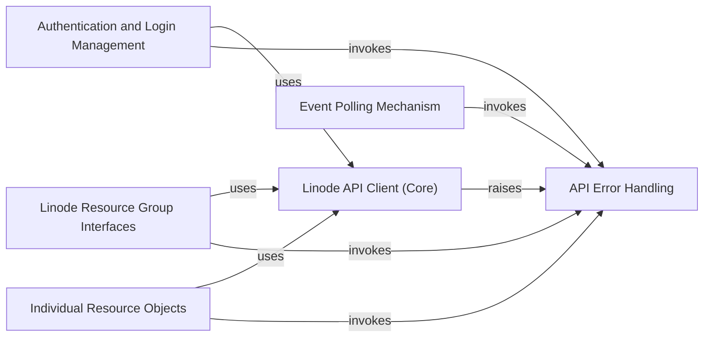

## Component Details

This system provides a comprehensive Python client for interacting with the Linode API. It encompasses core functionalities such as making authenticated API requests, managing various Linode resources through high-level group interfaces and individual resource objects, handling asynchronous API events, and robustly managing and reporting API-related errors. The client ensures secure access via authentication and token management, offering a structured and reliable way to programmatically control Linode services.

### Linode API Client (Core)
The central component responsible for making HTTP requests to the Linode API, handling authentication, and managing the session. It includes the fundamental logic for API communication and initial error checking.

**Related Classes/Methods**:

- <a href="https://github.com/linode/python-linode-api/blob/master/linode_api4/linode_client.py#L54-L488" target="_blank" rel="noopener noreferrer">`linode_api4.linode_client.LinodeClient` (54:488)</a>
- <a href="https://github.com/linode/python-linode-api/blob/master/linode_api4/linode_client.py#L250-L302" target="_blank" rel="noopener noreferrer">`linode_api4.linode_client.LinodeClient:_api_call` (250:302)</a>
- <a href="https://github.com/linode/python-linode-api/blob/master/linode_api4/linode_client.py#L304-L333" target="_blank" rel="noopener noreferrer">`linode_api4.linode_client.LinodeClient:_get_objects` (304:333)</a>

### API Error Handling
Manages and represents various error types that can be returned by the Linode API, providing structured information for error diagnosis and handling. This component defines and manages the various error types that can be returned by the Linode API, providing methods to parse API responses into specific error objects for consistent error reporting throughout the library.

**Related Classes/Methods**:

- <a href="https://github.com/linode/python-linode-api/blob/master/linode_api4/errors.py#L11-L100" target="_blank" rel="noopener noreferrer">`linode_api4.errors.ApiError` (11:100)</a>
- <a href="https://github.com/linode/python-linode-api/blob/master/linode_api4/errors.py#L37-L100" target="_blank" rel="noopener noreferrer">`linode_api4.errors.ApiError:from_response` (37:100)</a>
- <a href="https://github.com/linode/python-linode-api/blob/master/linode_api4/errors.py#L103-L149" target="_blank" rel="noopener noreferrer">`linode_api4.errors.UnexpectedResponseError` (103:149)</a>
- <a href="https://github.com/linode/python-linode-api/blob/master/linode_api4/errors.py#L126-L149" target="_blank" rel="noopener noreferrer">`linode_api4.errors.UnexpectedResponseError:from_response` (126:149)</a>
- <a href="https://github.com/linode/python-linode-api/blob/master/linode_api4/polling.py#L9-L26" target="_blank" rel="noopener noreferrer">`linode_api4.polling.EventError` (9:26)</a>

### Authentication and Login Management
This component specifically handles user authentication flows, including OAuth processes and the refreshing or expiring of access tokens, ensuring secure access to the Linode API.

**Related Classes/Methods**:

- <a href="https://github.com/linode/python-linode-api/blob/master/linode_api4/login_client.py#L325-L519" target="_blank" rel="noopener noreferrer">`linode_api4.login_client.LinodeLoginClient` (325:519)</a>
- <a href="https://github.com/linode/python-linode-api/blob/master/linode_api4/login_client.py#L393-L447" target="_blank" rel="noopener noreferrer">`linode_api4.login_client.LinodeLoginClient:finish_oauth` (393:447)</a>
- <a href="https://github.com/linode/python-linode-api/blob/master/linode_api4/login_client.py#L449-L488" target="_blank" rel="noopener noreferrer">`linode_api4.login_client.LinodeLoginClient:refresh_oauth_token` (449:488)</a>
- <a href="https://github.com/linode/python-linode-api/blob/master/linode_api4/login_client.py#L490-L519" target="_blank" rel="noopener noreferrer">`linode_api4.login_client.LinodeLoginClient:expire_token` (490:519)</a>

### Linode Resource Group Interfaces
These components serve as high-level interfaces for managing collections of Linode resources. They provide methods for creating, listing, and performing bulk operations on specific resource types like Linodes, Domains, or Volumes.

**Related Classes/Methods**:

- <a href="https://github.com/linode/python-linode-api/blob/master/linode_api4/groups/placement.py#L34-L76" target="_blank" rel="noopener noreferrer">`linode_api4.groups.placement.PlacementAPIGroup:group_create` (34:76)</a>
- <a href="https://github.com/linode/python-linode-api/blob/master/linode_api4/groups/database.py#L122-L184" target="_blank" rel="noopener noreferrer">`linode_api4.groups.database.DatabaseGroup:mysql_create` (122:184)</a>
- <a href="https://github.com/linode/python-linode-api/blob/master/linode_api4/groups/database.py#L186-L239" target="_blank" rel="noopener noreferrer">`linode_api4.groups.database.DatabaseGroup:mysql_fork` (186:239)</a>
- <a href="https://github.com/linode/python-linode-api/blob/master/linode_api4/groups/database.py#L256-L321" target="_blank" rel="noopener noreferrer">`linode_api4.groups.database.DatabaseGroup:postgresql_create` (256:321)</a>
- <a href="https://github.com/linode/python-linode-api/blob/master/linode_api4/groups/database.py#L323-L377" target="_blank" rel="noopener noreferrer">`linode_api4.groups.database.DatabaseGroup:postgresql_fork` (323:377)</a>
- <a href="https://github.com/linode/python-linode-api/blob/master/linode_api4/groups/tag.py#L28-L116" target="_blank" rel="noopener noreferrer">`linode_api4.groups.tag.TagGroup:create` (28:116)</a>
- <a href="https://github.com/linode/python-linode-api/blob/master/linode_api4/groups/volume.py#L28-L77" target="_blank" rel="noopener noreferrer">`linode_api4.groups.volume.VolumeGroup:create` (28:77)</a>
- <a href="https://github.com/linode/python-linode-api/blob/master/linode_api4/groups/object_storage.py#L93-L195" target="_blank" rel="noopener noreferrer">`linode_api4.groups.object_storage.ObjectStorageGroup:keys_create` (93:195)</a>
- <a href="https://github.com/linode/python-linode-api/blob/master/linode_api4/groups/object_storage.py#L278-L298" target="_blank" rel="noopener noreferrer">`linode_api4.groups.object_storage.ObjectStorageGroup:transfer` (278:298)</a>
- <a href="https://github.com/linode/python-linode-api/blob/master/linode_api4/groups/object_storage.py#L345-L433" target="_blank" rel="noopener noreferrer">`linode_api4.groups.object_storage.ObjectStorageGroup:bucket_create` (345:433)</a>
- <a href="https://github.com/linode/python-linode-api/blob/master/linode_api4/groups/object_storage.py#L447-L520" target="_blank" rel="noopener noreferrer">`linode_api4.groups.object_storage.ObjectStorageGroup:object_url_create` (447:520)</a>
- <a href="https://github.com/linode/python-linode-api/blob/master/linode_api4/groups/support.py#L38-L105" target="_blank" rel="noopener noreferrer">`linode_api4.groups.support.SupportGroup:ticket_open` (38:105)</a>
- <a href="https://github.com/linode/python-linode-api/blob/master/linode_api4/groups/domain.py#L27-L61" target="_blank" rel="noopener noreferrer">`linode_api4.groups.domain.DomainGroup:create` (27:61)</a>
- <a href="https://github.com/linode/python-linode-api/blob/master/linode_api4/groups/linode.py#L136-L356" target="_blank" rel="noopener noreferrer">`linode_api4.groups.linode.LinodeGroup:instance_create` (136:356)</a>
- <a href="https://github.com/linode/python-linode-api/blob/master/linode_api4/groups/linode.py#L392-L451" target="_blank" rel="noopener noreferrer">`linode_api4.groups.linode.LinodeGroup:stackscript_create` (392:451)</a>
- <a href="https://github.com/linode/python-linode-api/blob/master/linode_api4/groups/monitor.py#L123-L153" target="_blank" rel="noopener noreferrer">`linode_api4.groups.monitor.MonitorGroup:create_token` (123:153)</a>
- <a href="https://github.com/linode/python-linode-api/blob/master/linode_api4/groups/account.py#L29-L49" target="_blank" rel="noopener noreferrer">`linode_api4.groups.account.AccountGroup:__call__` (29:49)</a>
- <a href="https://github.com/linode/python-linode-api/blob/master/linode_api4/groups/account.py#L83-L102" target="_blank" rel="noopener noreferrer">`linode_api4.groups.account.AccountGroup:settings` (83:102)</a>
- <a href="https://github.com/linode/python-linode-api/blob/master/linode_api4/groups/account.py#L143-L171" target="_blank" rel="noopener noreferrer">`linode_api4.groups.account.AccountGroup:oauth_client_create` (143:171)</a>
- <a href="https://github.com/linode/python-linode-api/blob/master/linode_api4/groups/account.py#L228-L278" target="_blank" rel="noopener noreferrer">`linode_api4.groups.account.AccountGroup:add_payment_method` (228:278)</a>
- <a href="https://github.com/linode/python-linode-api/blob/master/linode_api4/groups/account.py#L296-L312" target="_blank" rel="noopener noreferrer">`linode_api4.groups.account.AccountGroup:linode_managed_enable` (296:312)</a>
- <a href="https://github.com/linode/python-linode-api/blob/master/linode_api4/groups/account.py#L314-L338" target="_blank" rel="noopener noreferrer">`linode_api4.groups.account.AccountGroup:add_promo_code` (314:338)</a>
- <a href="https://github.com/linode/python-linode-api/blob/master/linode_api4/groups/account.py#L352-L393" target="_blank" rel="noopener noreferrer">`linode_api4.groups.account.AccountGroup:service_transfer_create` (352:393)</a>
- <a href="https://github.com/linode/python-linode-api/blob/master/linode_api4/groups/account.py#L395-L411" target="_blank" rel="noopener noreferrer">`linode_api4.groups.account.AccountGroup:transfer` (395:411)</a>
- <a href="https://github.com/linode/python-linode-api/blob/master/linode_api4/groups/account.py#L413-L456" target="_blank" rel="noopener noreferrer">`linode_api4.groups.account.AccountGroup:user_create` (413:456)</a>
- <a href="https://github.com/linode/python-linode-api/blob/master/linode_api4/groups/lke.py#L61-L149" target="_blank" rel="noopener noreferrer">`linode_api4.groups.lke.LKEGroup:cluster_create` (61:149)</a>
- <a href="https://github.com/linode/python-linode-api/blob/master/linode_api4/groups/image.py#L33-L83" target="_blank" rel="noopener noreferrer">`linode_api4.groups.image.ImageGroup:create` (33:83)</a>
- <a href="https://github.com/linode/python-linode-api/blob/master/linode_api4/groups/image.py#L85-L132" target="_blank" rel="noopener noreferrer">`linode_api4.groups.image.ImageGroup:create_upload` (85:132)</a>
- <a href="https://github.com/linode/python-linode-api/blob/master/linode_api4/groups/nodebalancer.py#L27-L52" target="_blank" rel="noopener noreferrer">`linode_api4.groups.nodebalancer.NodeBalancerGroup:create` (27:52)</a>
- <a href="https://github.com/linode/python-linode-api/blob/master/linode_api4/groups/longview.py#L31-L55" target="_blank" rel="noopener noreferrer">`linode_api4.groups.longview.LongviewGroup:client_create` (31:55)</a>
- <a href="https://github.com/linode/python-linode-api/blob/master/linode_api4/groups/vpc.py#L30-L82" target="_blank" rel="noopener noreferrer">`linode_api4.groups.vpc.VPCGroup:create` (30:82)</a>
- <a href="https://github.com/linode/python-linode-api/blob/master/linode_api4/groups/profile.py#L23-L44" target="_blank" rel="noopener noreferrer">`linode_api4.groups.profile.ProfileGroup:__call__` (23:44)</a>
- <a href="https://github.com/linode/python-linode-api/blob/master/linode_api4/groups/profile.py#L119-L139" target="_blank" rel="noopener noreferrer">`linode_api4.groups.profile.ProfileGroup:phone_number_delete` (119:139)</a>
- <a href="https://github.com/linode/python-linode-api/blob/master/linode_api4/groups/profile.py#L141-L172" target="_blank" rel="noopener noreferrer">`linode_api4.groups.profile.ProfileGroup:phone_number_verify` (141:172)</a>
- <a href="https://github.com/linode/python-linode-api/blob/master/linode_api4/groups/profile.py#L174-L210" target="_blank" rel="noopener noreferrer">`linode_api4.groups.profile.ProfileGroup:phone_number_verification_code_send` (174:210)</a>
- <a href="https://github.com/linode/python-linode-api/blob/master/linode_api4/groups/profile.py#L238-L272" target="_blank" rel="noopener noreferrer">`linode_api4.groups.profile.ProfileGroup:token_create` (238:272)</a>
- <a href="https://github.com/linode/python-linode-api/blob/master/linode_api4/groups/profile.py#L304-L345" target="_blank" rel="noopener noreferrer">`linode_api4.groups.profile.ProfileGroup:ssh_key_upload` (304:345)</a>
- <a href="https://github.com/linode/python-linode-api/blob/master/linode_api4/groups/networking.py#L36-L95" target="_blank" rel="noopener noreferrer">`linode_api4.groups.networking.NetworkingGroup:firewall_create` (36:95)</a>
- <a href="https://github.com/linode/python-linode-api/blob/master/linode_api4/groups/networking.py#L215-L245" target="_blank" rel="noopener noreferrer">`linode_api4.groups.networking.NetworkingGroup:ip_allocate` (215:245)</a>

### Individual Resource Objects
These components represent specific instances of Linode resources (e.g., a particular Linode Instance or a Volume). They provide methods to interact with and modify the state of that individual resource via the API.

**Related Classes/Methods**:

- <a href="https://github.com/linode/python-linode-api/blob/master/linode_api4/objects/volume.py#L57-L89" target="_blank" rel="noopener noreferrer">`linode_api4.objects.volume.Volume:attach` (57:89)</a>
- <a href="https://github.com/linode/python-linode-api/blob/master/linode_api4/objects/volume.py#L126-L147" target="_blank" rel="noopener noreferrer">`linode_api4.objects.volume.Volume:clone` (126:147)</a>
- <a href="https://github.com/linode/python-linode-api/blob/master/linode_api4/objects/object_storage.py#L114-L127" target="_blank" rel="noopener noreferrer">`linode_api4.objects.object_storage.ObjectStorageBucket:make_instance` (114:127)</a>
- <a href="https://github.com/linode/python-linode-api/blob/master/linode_api4/objects/object_storage.py#L129-L152" target="_blank" rel="noopener noreferrer">`linode_api4.objects.object_storage.ObjectStorageBucket:access_get` (129:152)</a>
- <a href="https://github.com/linode/python-linode-api/blob/master/linode_api4/objects/object_storage.py#L154-L193" target="_blank" rel="noopener noreferrer">`linode_api4.objects.object_storage.ObjectStorageBucket:access_modify` (154:193)</a>
- <a href="https://github.com/linode/python-linode-api/blob/master/linode_api4/objects/object_storage.py#L195-L234" target="_blank" rel="noopener noreferrer">`linode_api4.objects.object_storage.ObjectStorageBucket:access_update` (195:234)</a>
- <a href="https://github.com/linode/python-linode-api/blob/master/linode_api4/objects/object_storage.py#L236-L257" target="_blank" rel="noopener noreferrer">`linode_api4.objects.object_storage.ObjectStorageBucket:ssl_cert_delete` (236:257)</a>
- <a href="https://github.com/linode/python-linode-api/blob/master/linode_api4/objects/object_storage.py#L259-L282" target="_blank" rel="noopener noreferrer">`linode_api4.objects.object_storage.ObjectStorageBucket:ssl_cert` (259:282)</a>
- <a href="https://github.com/linode/python-linode-api/blob/master/linode_api4/objects/object_storage.py#L284-L325" target="_blank" rel="noopener noreferrer">`linode_api4.objects.object_storage.ObjectStorageBucket:ssl_cert_upload` (284:325)</a>
- <a href="https://github.com/linode/python-linode-api/blob/master/linode_api4/objects/object_storage.py#L327-L391" target="_blank" rel="noopener noreferrer">`linode_api4.objects.object_storage.ObjectStorageBucket:contents` (327:391)</a>
- <a href="https://github.com/linode/python-linode-api/blob/master/linode_api4/objects/object_storage.py#L393-L428" target="_blank" rel="noopener noreferrer">`linode_api4.objects.object_storage.ObjectStorageBucket:object_acl_config` (393:428)</a>
- <a href="https://github.com/linode/python-linode-api/blob/master/linode_api4/objects/object_storage.py#L430-L471" target="_blank" rel="noopener noreferrer">`linode_api4.objects.object_storage.ObjectStorageBucket:object_acl_config_update` (430:471)</a>
- <a href="https://github.com/linode/python-linode-api/blob/master/linode_api4/objects/support.py#L116-L143" target="_blank" rel="noopener noreferrer">`linode_api4.objects.support.SupportTicket:post_reply` (116:143)</a>
- <a href="https://github.com/linode/python-linode-api/blob/master/linode_api4/objects/support.py#L145-L181" target="_blank" rel="noopener noreferrer">`linode_api4.objects.support.SupportTicket:upload_attachment` (145:181)</a>
- <a href="https://github.com/linode/python-linode-api/blob/master/linode_api4/objects/domain.py#L62-L98" target="_blank" rel="noopener noreferrer">`linode_api4.objects.domain.Domain:record_create` (62:98)</a>
- `linode_api4.objects.linode.Disk:duplicate` (full file reference)
- `linode_api4.objects.linode.Config:_interface_create` (full file reference)
- `linode_api4.objects.linode.Instance:ips` (full file reference)
- `linode_api4.objects.linode.Instance:available_backups` (full file reference)
- `linode_api4.objects.linode.Instance:transfer` (full file reference)
- `linode_api4.objects.linode.Instance:config_create` (full file reference)
- `linode_api4.objects.linode.Instance:disk_create` (full file reference)
- `linode_api4.objects.linode.Instance:snapshot` (full file reference)
- `linode_api4.objects.linode.Instance:ip_allocate` (full file reference)
- `linode_api4.objects.linode.Instance:rebuild` (full file reference)
- `linode_api4.objects.linode.Instance:clone` (full file reference)
- <a href="https://github.com/linode/python-linode-api/blob/master/linode_api4/objects/account.py#L71-L89" target="_blank" rel="noopener noreferrer">`linode_api4.objects.account.ChildAccount:create_token` (71:89)</a>
- <a href="https://github.com/linode/python-linode-api/blob/master/linode_api4/objects/account.py#L111-L127" target="_blank" rel="noopener noreferrer">`linode_api4.objects.account.ServiceTransfer:service_transfer_accept` (111:127)</a>
- <a href="https://github.com/linode/python-linode-api/blob/master/linode_api4/objects/account.py#L146-L162" target="_blank" rel="noopener noreferrer">`linode_api4.objects.account.PaymentMethod:payment_method_make_default` (146:162)</a>
- <a href="https://github.com/linode/python-linode-api/blob/master/linode_api4/objects/account.py#L409-L425" target="_blank" rel="noopener noreferrer">`linode_api4.objects.account.OAuthClient:reset_secret` (409:425)</a>
- <a href="https://github.com/linode/python-linode-api/blob/master/linode_api4/objects/account.py#L427-L455" target="_blank" rel="noopener noreferrer">`linode_api4.objects.account.OAuthClient:thumbnail` (427:455)</a>
- <a href="https://github.com/linode/python-linode-api/blob/master/linode_api4/objects/account.py#L457-L488" target="_blank" rel="noopener noreferrer">`linode_api4.objects.account.OAuthClient:set_thumbnail` (457:488)</a>
- <a href="https://github.com/linode/python-linode-api/blob/master/linode_api4/objects/region.py#L41-L51" target="_blank" rel="noopener noreferrer">`linode_api4.objects.region.Region:availability` (41:51)</a>
- <a href="https://github.com/linode/python-linode-api/blob/master/linode_api4/objects/lke.py#L412-L478" target="_blank" rel="noopener noreferrer">`linode_api4.objects.lke.LKECluster:node_pool_create` (412:478)</a>
- <a href="https://github.com/linode/python-linode-api/blob/master/linode_api4/objects/nodebalancer.py#L157-L198" target="_blank" rel="noopener noreferrer">`linode_api4.objects.nodebalancer.NodeBalancerConfig:node_create` (157:198)</a>
- <a href="https://github.com/linode/python-linode-api/blob/master/linode_api4/objects/nodebalancer.py#L258-L284" target="_blank" rel="noopener noreferrer">`linode_api4.objects.nodebalancer.NodeBalancer:config_create` (258:284)</a>
- <a href="https://github.com/linode/python-linode-api/blob/master/linode_api4/objects/nodebalancer.py#L286-L320" target="_blank" rel="noopener noreferrer">`linode_api4.objects.nodebalancer.NodeBalancer:config_rebuild` (286:320)</a>
- <a href="https://github.com/linode/python-linode-api/blob/master/linode_api4/objects/nodebalancer.py#L322-L339" target="_blank" rel="noopener noreferrer">`linode_api4.objects.nodebalancer.NodeBalancer:statistics` (322:339)</a>
- <a href="https://github.com/linode/python-linode-api/blob/master/linode_api4/objects/vpc.py#L63-L101" target="_blank" rel="noopener noreferrer">`linode_api4.objects.vpc.VPC:subnet_create` (63:101)</a>
- <a href="https://github.com/linode/python-linode-api/blob/master/linode_api4/objects/profile.py#L166-L186" target="_blank" rel="noopener noreferrer">`linode_api4.objects.profile.Profile:add_whitelist_entry` (166:186)</a>
- `linode_api4.objects.networking.IPAddress:ip_allocate` (full file reference)
- <a href="https://github.com/linode/python-linode-api/blob/master/linode_api4/objects/networking.py#L278-L307" target="_blank" rel="noopener noreferrer">`linode_api4.objects.networking.Firewall:device_create` (278:307)</a>

### Event Polling Mechanism
This component is dedicated to monitoring and reacting to asynchronous events from the Linode API, allowing the client to wait for specific event completions or handle event-related errors.

**Related Classes/Methods**:

- <a href="https://github.com/linode/python-linode-api/blob/master/linode_api4/polling.py#L215-L250" target="_blank" rel="noopener noreferrer">`linode_api4.polling.EventPoller:wait_for_next_event_finished` (215:250)</a>

### [FAQ](https://github.com/CodeBoarding/GeneratedOnBoardings/tree/main?tab=readme-ov-file#faq)