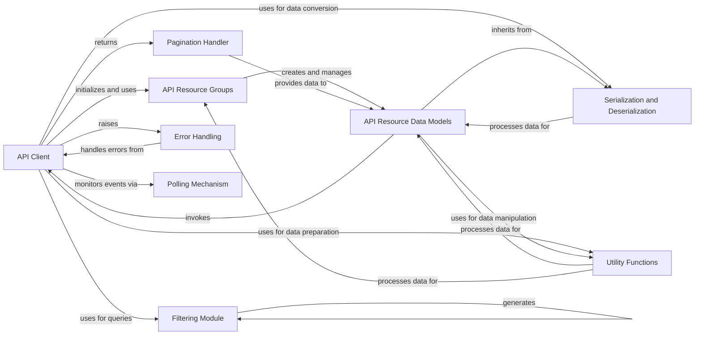

## Component Details

This graph provides an overview of the `API Resource Data Models` component within the `python-linode-api` project, detailing its structure, purpose, and interactions with other key components. The `API Resource Data Models` component defines concrete data models for various Linode API resources, extending core API data models to include resource-specific attributes and methods. It interacts with the `API Client` for performing actions on resources, relies on `Serialization and Deserialization` for data conversion, and utilizes `Utility Functions` for data manipulation. The overall flow involves the `API Client` initializing and using `API Resource Groups`, which in turn create and manage instances of `API Resource Data Models`. The `API Client` also handles pagination through the `Pagination Handler`, uses the `Filtering Module` for queries, and incorporates `Error Handling` for robust operation. The `Polling Mechanism` allows for monitoring asynchronous API events.

### API Client
The central interface for interacting with the Linode API. It manages authentication, constructs and sends HTTP requests, handles retries, and provides access to various API resource groups. It also includes methods for loading specific API objects and handling paginated responses.

**Related Classes/Methods**:

- <a href="https://github.com/linode/python-linode-api/blob/master/linode_api4/linode_client.py#L54-L488" target="_blank" rel="noopener noreferrer">`linode_api4.linode_client.LinodeClient` (54:488)</a>
- `linode_api4.linode_client._api_call` (full file reference)
- `linode_api4.linode_client._get_objects` (full file reference)
- `linode_api4.linode_client.get` (full file reference)
- `linode_api4.linode_client.post` (full file reference)
- `linode_api4.linode_client.put` (full file reference)
- `linode_api4.linode_client.delete` (full file reference)
- `linode_api4.linode_client.load` (full file reference)

### API Resource Groups
These classes organize and encapsulate methods for managing specific Linode API resources, such as Linodes, Databases, Accounts, and Domains. They act as facades, providing a structured way to interact with different parts of the Linode API through the main API Client.

**Related Classes/Methods**:

- <a href="https://github.com/linode/python-linode-api/blob/master/linode_api4/groups/placement.py#L34-L76" target="_blank" rel="noopener noreferrer">`linode_api4.groups.placement.PlacementAPIGroup.group_create` (34:76)</a>
- <a href="https://github.com/linode/python-linode-api/blob/master/linode_api4/groups/database.py#L122-L184" target="_blank" rel="noopener noreferrer">`linode_api4.groups.database.DatabaseGroup.mysql_create` (122:184)</a>
- <a href="https://github.com/linode/python-linode-api/blob/master/linode_api4/groups/database.py#L256-L321" target="_blank" rel="noopener noreferrer">`linode_api4.groups.database.DatabaseGroup.postgresql_create` (256:321)</a>
- <a href="https://github.com/linode/python-linode-api/blob/master/linode_api4/groups/tag.py#L28-L116" target="_blank" rel="noopener noreferrer">`linode_api4.groups.tag.TagGroup.create` (28:116)</a>
- <a href="https://github.com/linode/python-linode-api/blob/master/linode_api4/groups/volume.py#L28-L77" target="_blank" rel="noopener noreferrer">`linode_api4.groups.volume.VolumeGroup.create` (28:77)</a>
- <a href="https://github.com/linode/python-linode-api/blob/master/linode_api4/groups/object_storage.py#L93-L195" target="_blank" rel="noopener noreferrer">`linode_api4.groups.object_storage.ObjectStorageGroup.keys_create` (93:195)</a>
- <a href="https://github.com/linode/python-linode-api/blob/master/linode_api4/groups/support.py#L38-L105" target="_blank" rel="noopener noreferrer">`linode_api4.groups.support.SupportGroup.ticket_open` (38:105)</a>
- <a href="https://github.com/linode/python-linode-api/blob/master/linode_api4/groups/domain.py#L27-L61" target="_blank" rel="noopener noreferrer">`linode_api4.groups.domain.DomainGroup.create` (27:61)</a>
- <a href="https://github.com/linode/python-linode-api/blob/master/linode_api4/groups/linode.py#L136-L356" target="_blank" rel="noopener noreferrer">`linode_api4.groups.linode.LinodeGroup.instance_create` (136:356)</a>
- <a href="https://github.com/linode/python-linode-api/blob/master/linode_api4/groups/linode.py#L392-L451" target="_blank" rel="noopener noreferrer">`linode_api4.groups.linode.LinodeGroup.stackscript_create` (392:451)</a>
- <a href="https://github.com/linode/python-linode-api/blob/master/linode_api4/groups/account.py#L29-L49" target="_blank" rel="noopener noreferrer">`linode_api4.groups.account.AccountGroup.__call__` (29:49)</a>
- <a href="https://github.com/linode/python-linode-api/blob/master/linode_api4/groups/lke.py#L61-L149" target="_blank" rel="noopener noreferrer">`linode_api4.groups.lke.LKEGroup.cluster_create` (61:149)</a>
- <a href="https://github.com/linode/python-linode-api/blob/master/linode_api4/groups/image.py#L33-L83" target="_blank" rel="noopener noreferrer">`linode_api4.groups.image.ImageGroup.create` (33:83)</a>
- <a href="https://github.com/linode/python-linode-api/blob/master/linode_api4/groups/nodebalancer.py#L27-L52" target="_blank" rel="noopener noreferrer">`linode_api4.groups.nodebalancer.NodeBalancerGroup.create` (27:52)</a>
- <a href="https://github.com/linode/python-linode-api/blob/master/linode_api4/groups/profile.py#L23-L44" target="_blank" rel="noopener noreferrer">`linode_api4.groups.profile.ProfileGroup.__call__` (23:44)</a>
- <a href="https://github.com/linode/python-linode-api/blob/master/linode_api4/groups/networking.py#L36-L95" target="_blank" rel="noopener noreferrer">`linode_api4.groups.networking.NetworkingGroup.firewall_create` (36:95)</a>

### API Resource Data Models
Concrete data models representing various Linode API resources such as Linode instances, databases, object storage, networking components, LKE clusters, NodeBalancers, account details, user profiles, domains, volumes, images, tags, support tickets, placement groups, and regions. These models extend `linode_api4.objects.base.Base` (the core API data model) and `linode_api4.objects.serializable.JSONObject` to provide resource-specific attributes and methods, and facilitate serialization and deserialization. They provide properties to access resource attributes and methods to perform actions on the specific resource, such as updating, deleting, or performing resource-specific operations.

**Related Classes/Methods**:

- <a href="https://github.com/linode/python-linode-api/blob/master/linode_api4/objects/base.py#L147-L506" target="_blank" rel="noopener noreferrer">`linode_api4.objects.base.Base` (147:506)</a>
- <a href="https://github.com/linode/python-linode-api/blob/master/linode_api4/objects/base.py#L254-L295" target="_blank" rel="noopener noreferrer">`linode_api4.objects.base.Base.save` (254:295)</a>
- <a href="https://github.com/linode/python-linode-api/blob/master/linode_api4/objects/base.py#L297-L306" target="_blank" rel="noopener noreferrer">`linode_api4.objects.base.Base.delete` (297:306)</a>
- <a href="https://github.com/linode/python-linode-api/blob/master/linode_api4/objects/base.py#L308-L320" target="_blank" rel="noopener noreferrer">`linode_api4.objects.base.Base.invalidate` (308:320)</a>
- <a href="https://github.com/linode/python-linode-api/blob/master/linode_api4/objects/base.py#L355-L360" target="_blank" rel="noopener noreferrer">`linode_api4.objects.base.Base._api_get` (355:360)</a>
- <a href="https://github.com/linode/python-linode-api/blob/master/linode_api4/objects/base.py#L362-L453" target="_blank" rel="noopener noreferrer">`linode_api4.objects.base.Base._populate` (362:453)</a>
- <a href="https://github.com/linode/python-linode-api/blob/master/linode_api4/objects/dbase.py#L4-L27" target="_blank" rel="noopener noreferrer">`linode_api4.objects.dbase.DerivedBase` (4:27)</a>
- <a href="https://github.com/linode/python-linode-api/blob/master/linode_api4/objects/serializable.py#L43-L258" target="_blank" rel="noopener noreferrer">`linode_api4.objects.serializable.JSONObject` (43:258)</a>
- `linode_api4.objects.linode.Instance` (full file reference)
- `linode_api4.objects.linode.Backup` (full file reference)
- `linode_api4.objects.linode.Disk` (full file reference)
- `linode_api4.objects.linode.Config` (full file reference)
- `linode_api4.objects.linode.NetworkInterface` (full file reference)
- `linode_api4.objects.linode.StackScript` (full file reference)
- `linode_api4.objects.linode.Type` (full file reference)
- `linode_api4.objects.linode.UserDefinedField` (full file reference)
- <a href="https://github.com/linode/python-linode-api/blob/master/linode_api4/objects/database.py#L15-L44" target="_blank" rel="noopener noreferrer">`linode_api4.objects.database.DatabaseType` (15:44)</a>
- <a href="https://github.com/linode/python-linode-api/blob/master/linode_api4/objects/database.py#L47-L74" target="_blank" rel="noopener noreferrer">`linode_api4.objects.database.DatabaseEngine` (47:74)</a>
- <a href="https://github.com/linode/python-linode-api/blob/master/linode_api4/objects/database.py#L274-L436" target="_blank" rel="noopener noreferrer">`linode_api4.objects.database.MySQLDatabase` (274:436)</a>
- <a href="https://github.com/linode/python-linode-api/blob/master/linode_api4/objects/database.py#L439-L603" target="_blank" rel="noopener noreferrer">`linode_api4.objects.database.PostgreSQLDatabase` (439:603)</a>
- <a href="https://github.com/linode/python-linode-api/blob/master/linode_api4/objects/database.py#L612-L670" target="_blank" rel="noopener noreferrer">`linode_api4.objects.database.Database` (612:670)</a>
- <a href="https://github.com/linode/python-linode-api/blob/master/linode_api4/objects/object_storage.py#L82-L502" target="_blank" rel="noopener noreferrer">`linode_api4.objects.object_storage.ObjectStorageBucket` (82:502)</a>
- <a href="https://github.com/linode/python-linode-api/blob/master/linode_api4/objects/object_storage.py#L561-L578" target="_blank" rel="noopener noreferrer">`linode_api4.objects.object_storage.ObjectStorageKeys` (561:578)</a>
- <a href="https://github.com/linode/python-linode-api/blob/master/linode_api4/objects/object_storage.py#L581-L616" target="_blank" rel="noopener noreferrer">`linode_api4.objects.object_storage.ObjectStorageQuota` (581:616)</a>
- <a href="https://github.com/linode/python-linode-api/blob/master/linode_api4/objects/networking.py#L198-L307" target="_blank" rel="noopener noreferrer">`linode_api4.objects.networking.Firewall` (198:307)</a>
- <a href="https://github.com/linode/python-linode-api/blob/master/linode_api4/objects/networking.py#L60-L127" target="_blank" rel="noopener noreferrer">`linode_api4.objects.networking.IPAddress` (60:127)</a>
- <a href="https://github.com/linode/python-linode-api/blob/master/linode_api4/objects/networking.py#L26-L45" target="_blank" rel="noopener noreferrer">`linode_api4.objects.networking.IPv6Range` (26:45)</a>
- <a href="https://github.com/linode/python-linode-api/blob/master/linode_api4/objects/networking.py#L179-L195" target="_blank" rel="noopener noreferrer">`linode_api4.objects.networking.FirewallDevice` (179:195)</a>
- <a href="https://github.com/linode/python-linode-api/blob/master/linode_api4/objects/lke.py#L267-L639" target="_blank" rel="noopener noreferrer">`linode_api4.objects.lke.LKECluster` (267:639)</a>
- <a href="https://github.com/linode/python-linode-api/blob/master/linode_api4/objects/lke.py#L173-L264" target="_blank" rel="noopener noreferrer">`linode_api4.objects.lke.LKENodePool` (173:264)</a>
- <a href="https://github.com/linode/python-linode-api/blob/master/linode_api4/objects/lke.py#L147-L170" target="_blank" rel="noopener noreferrer">`linode_api4.objects.lke.LKENodePoolNode` (147:170)</a>
- <a href="https://github.com/linode/python-linode-api/blob/master/linode_api4/objects/nodebalancer.py#L232-L357" target="_blank" rel="noopener noreferrer">`linode_api4.objects.nodebalancer.NodeBalancer` (232:357)</a>
- <a href="https://github.com/linode/python-linode-api/blob/master/linode_api4/objects/nodebalancer.py#L75-L229" target="_blank" rel="noopener noreferrer">`linode_api4.objects.nodebalancer.NodeBalancerConfig` (75:229)</a>
- <a href="https://github.com/linode/python-linode-api/blob/master/linode_api4/objects/nodebalancer.py#L30-L72" target="_blank" rel="noopener noreferrer">`linode_api4.objects.nodebalancer.NodeBalancerNode` (30:72)</a>
- <a href="https://github.com/linode/python-linode-api/blob/master/linode_api4/objects/account.py#L25-L56" target="_blank" rel="noopener noreferrer">`linode_api4.objects.account.Account` (25:56)</a>
- <a href="https://github.com/linode/python-linode-api/blob/master/linode_api4/objects/account.py#L183-L201" target="_blank" rel="noopener noreferrer">`linode_api4.objects.account.AccountSettings` (183:201)</a>
- <a href="https://github.com/linode/python-linode-api/blob/master/linode_api4/objects/account.py#L59-L89" target="_blank" rel="noopener noreferrer">`linode_api4.objects.account.ChildAccount` (59:89)</a>
- <a href="https://github.com/linode/python-linode-api/blob/master/linode_api4/objects/account.py#L204-L331" target="_blank" rel="noopener noreferrer">`linode_api4.objects.account.Event` (204:331)</a>
- <a href="https://github.com/linode/python-linode-api/blob/master/linode_api4/objects/account.py#L334-L366" target="_blank" rel="noopener noreferrer">`linode_api4.objects.account.InvoiceItem` (334:366)</a>
- <a href="https://github.com/linode/python-linode-api/blob/master/linode_api4/objects/account.py#L390-L488" target="_blank" rel="noopener noreferrer">`linode_api4.objects.account.OAuthClient` (390:488)</a>
- <a href="https://github.com/linode/python-linode-api/blob/master/linode_api4/objects/account.py#L130-L162" target="_blank" rel="noopener noreferrer">`linode_api4.objects.account.PaymentMethod` (130:162)</a>
- <a href="https://github.com/linode/python-linode-api/blob/master/linode_api4/objects/account.py#L92-L127" target="_blank" rel="noopener noreferrer">`linode_api4.objects.account.ServiceTransfer` (92:127)</a>
- <a href="https://github.com/linode/python-linode-api/blob/master/linode_api4/objects/account.py#L507-L555" target="_blank" rel="noopener noreferrer">`linode_api4.objects.account.User` (507:555)</a>
- <a href="https://github.com/linode/python-linode-api/blob/master/linode_api4/objects/account.py#L619-L703" target="_blank" rel="noopener noreferrer">`linode_api4.objects.account.UserGrants` (619:703)</a>
- <a href="https://github.com/linode/python-linode-api/blob/master/linode_api4/objects/account.py#L577-L616" target="_blank" rel="noopener noreferrer">`linode_api4.objects.account.Grant` (577:616)</a>
- <a href="https://github.com/linode/python-linode-api/blob/master/linode_api4/objects/profile.py#L59-L186" target="_blank" rel="noopener noreferrer">`linode_api4.objects.profile.Profile` (59:186)</a>
- <a href="https://github.com/linode/python-linode-api/blob/master/linode_api4/objects/profile.py#L25-L41" target="_blank" rel="noopener noreferrer">`linode_api4.objects.profile.PersonalAccessToken` (25:41)</a>
- <a href="https://github.com/linode/python-linode-api/blob/master/linode_api4/objects/profile.py#L189-L203" target="_blank" rel="noopener noreferrer">`linode_api4.objects.profile.SSHKey` (189:203)</a>
- <a href="https://github.com/linode/python-linode-api/blob/master/linode_api4/objects/profile.py#L44-L56" target="_blank" rel="noopener noreferrer">`linode_api4.objects.profile.WhitelistEntry` (44:56)</a>
- <a href="https://github.com/linode/python-linode-api/blob/master/linode_api4/objects/domain.py#L34-L160" target="_blank" rel="noopener noreferrer">`linode_api4.objects.domain.Domain` (34:160)</a>
- <a href="https://github.com/linode/python-linode-api/blob/master/linode_api4/objects/domain.py#L5-L31" target="_blank" rel="noopener noreferrer">`linode_api4.objects.domain.DomainRecord` (5:31)</a>
- <a href="https://github.com/linode/python-linode-api/blob/master/linode_api4/objects/volume.py#L31-L147" target="_blank" rel="noopener noreferrer">`linode_api4.objects.volume.Volume` (31:147)</a>
- <a href="https://github.com/linode/python-linode-api/blob/master/linode_api4/objects/image.py#L33-L89" target="_blank" rel="noopener noreferrer">`linode_api4.objects.image.Image` (33:89)</a>
- <a href="https://github.com/linode/python-linode-api/blob/master/linode_api4/objects/tag.py#L19-L79" target="_blank" rel="noopener noreferrer">`linode_api4.objects.tag.Tag` (19:79)</a>
- <a href="https://github.com/linode/python-linode-api/blob/master/linode_api4/objects/tag.py#L82-L132" target="_blank" rel="noopener noreferrer">`linode_api4.objects.tag.TaggedObjectProxy` (82:132)</a>
- <a href="https://github.com/linode/python-linode-api/blob/master/linode_api4/objects/support.py#L39-L190" target="_blank" rel="noopener noreferrer">`linode_api4.objects.support.SupportTicket` (39:190)</a>
- <a href="https://github.com/linode/python-linode-api/blob/master/linode_api4/objects/support.py#L18-L36" target="_blank" rel="noopener noreferrer">`linode_api4.objects.support.TicketReply` (18:36)</a>
- <a href="https://github.com/linode/python-linode-api/blob/master/linode_api4/objects/placement.py#L57-L128" target="_blank" rel="noopener noreferrer">`linode_api4.objects.placement.PlacementGroup` (57:128)</a>
- <a href="https://github.com/linode/python-linode-api/blob/master/linode_api4/objects/region.py#L19-L51" target="_blank" rel="noopener noreferrer">`linode_api4.objects.region.Region` (19:51)</a>

### Pagination Handler
This component is responsible for managing and iterating over paginated results returned by the Linode API. It constructs `PaginatedList` objects that allow users to easily access data across multiple pages without manually handling pagination logic.

**Related Classes/Methods**:

- <a href="https://github.com/linode/python-linode-api/blob/master/linode_api4/paginated_list.py#L6-L262" target="_blank" rel="noopener noreferrer">`linode_api4.paginated_list.PaginatedList` (6:262)</a>
- <a href="https://github.com/linode/python-linode-api/blob/master/linode_api4/paginated_list.py#L230-L262" target="_blank" rel="noopener noreferrer">`linode_api4.paginated_list.PaginatedList.make_paginated_list` (230:262)</a>

### Filtering Module
This module provides classes and methods for constructing complex filters that can be applied to API queries. It allows users to define conditions for filtering resources based on various attributes, supporting logical operations like AND and OR.

**Related Classes/Methods**:

- <a href="https://github.com/linode/python-linode-api/blob/master/linode_api4/objects/filtering.py#L85-L102" target="_blank" rel="noopener noreferrer">`linode_api4.objects.filtering.order_by` (85:102)</a>
- <a href="https://github.com/linode/python-linode-api/blob/master/linode_api4/objects/filtering.py#L105-L119" target="_blank" rel="noopener noreferrer">`linode_api4.objects.filtering.limit` (105:119)</a>
- <a href="https://github.com/linode/python-linode-api/blob/master/linode_api4/objects/filtering.py#L133-L139" target="_blank" rel="noopener noreferrer">`linode_api4.objects.filtering.Filter.__or__` (133:139)</a>
- <a href="https://github.com/linode/python-linode-api/blob/master/linode_api4/objects/filtering.py#L141-L147" target="_blank" rel="noopener noreferrer">`linode_api4.objects.filtering.Filter.__and__` (141:147)</a>
- <a href="https://github.com/linode/python-linode-api/blob/master/linode_api4/objects/filtering.py#L180-L181" target="_blank" rel="noopener noreferrer">`linode_api4.objects.filtering.FilterableAttribute.__eq__` (180:181)</a>
- <a href="https://github.com/linode/python-linode-api/blob/master/linode_api4/objects/filtering.py#L188-L189" target="_blank" rel="noopener noreferrer">`linode_api4.objects.filtering.FilterableAttribute.contains` (188:189)</a>
- <a href="https://github.com/linode/python-linode-api/blob/master/linode_api4/objects/filtering.py#L246-L251" target="_blank" rel="noopener noreferrer">`linode_api4.objects.filtering.FilterableMetaclass.__init__` (246:251)</a>

### Serialization and Deserialization
This component handles the conversion of Python objects to and from JSON format, which is essential for communicating with the RESTful Linode API. It ensures that data sent in requests is correctly formatted and that responses are parsed into usable Python objects.

**Related Classes/Methods**:

- <a href="https://github.com/linode/python-linode-api/blob/master/linode_api4/objects/serializable.py#L43-L258" target="_blank" rel="noopener noreferrer">`linode_api4.objects.serializable.JSONObject` (43:258)</a>
- <a href="https://github.com/linode/python-linode-api/blob/master/linode_api4/objects/serializable.py#L149-L167" target="_blank" rel="noopener noreferrer">`linode_api4.objects.serializable.JSONObject.from_json` (149:167)</a>
- <a href="https://github.com/linode/python-linode-api/blob/master/linode_api4/objects/serializable.py#L238-L242" target="_blank" rel="noopener noreferrer">`linode_api4.objects.serializable.JSONObject.dict` (238:242)</a>
- <a href="https://github.com/linode/python-linode-api/blob/master/linode_api4/objects/serializable.py#L169-L235" target="_blank" rel="noopener noreferrer">`linode_api4.objects.serializable.JSONObject._serialize` (169:235)</a>
- <a href="https://github.com/linode/python-linode-api/blob/master/linode_api4/objects/serializable.py#L89-L101" target="_blank" rel="noopener noreferrer">`linode_api4.objects.serializable.JSONObject._unwrap_type` (89:101)</a>
- <a href="https://github.com/linode/python-linode-api/blob/master/linode_api4/objects/serializable.py#L104-L114" target="_blank" rel="noopener noreferrer">`linode_api4.objects.serializable.JSONObject._try_from_json` (104:114)</a>
- <a href="https://github.com/linode/python-linode-api/blob/master/linode_api4/objects/serializable.py#L117-L133" target="_blank" rel="noopener noreferrer">`linode_api4.objects.serializable.JSONObject._parse_attr_list` (117:133)</a>
- <a href="https://github.com/linode/python-linode-api/blob/master/linode_api4/objects/serializable.py#L136-L146" target="_blank" rel="noopener noreferrer">`linode_api4.objects.serializable.JSONObject._parse_attr` (136:146)</a>

### Utility Functions
This component provides various helper functions that perform common data manipulation tasks, such as removing null keys from dictionaries or flattening request bodies. These utilities support the main API interaction logic by preparing data for requests.

**Related Classes/Methods**:

- <a href="https://github.com/linode/python-linode-api/blob/master/linode_api4/util.py#L8-L29" target="_blank" rel="noopener noreferrer">`linode_api4.util.drop_null_keys` (8:29)</a>
- <a href="https://github.com/linode/python-linode-api/blob/master/linode_api4/objects/base.py#L509-L535" target="_blank" rel="noopener noreferrer">`linode_api4.objects.base._flatten_request_body_recursive` (509:535)</a>
- <a href="https://github.com/linode/python-linode-api/blob/master/linode_api4/common.py#L16-L62" target="_blank" rel="noopener noreferrer">`linode_api4.common.load_and_validate_keys` (16:62)</a>

### Error Handling
This component defines and manages custom exceptions for API-related errors, such as unexpected responses from the server. It ensures that specific error conditions are caught and handled gracefully, providing meaningful feedback to the user.

**Related Classes/Methods**:

- <a href="https://github.com/linode/python-linode-api/blob/master/linode_api4/errors.py#L11-L100" target="_blank" rel="noopener noreferrer">`linode_api4.errors.ApiError` (11:100)</a>
- <a href="https://github.com/linode/python-linode-api/blob/master/linode_api4/errors.py#L103-L149" target="_blank" rel="noopener noreferrer">`linode_api4.errors.UnexpectedResponseError` (103:149)</a>

### Polling Mechanism
This component provides functionality for polling Linode API events, allowing the client to wait for specific events to occur or for operations to complete. It is crucial for asynchronous operations where the client needs to monitor the status of a resource.

**Related Classes/Methods**:

- <a href="https://github.com/linode/python-linode-api/blob/master/linode_api4/polling.py#L171-L213" target="_blank" rel="noopener noreferrer">`linode_api4.polling.EventPoller.wait_for_next_event` (171:213)</a>
- <a href="https://github.com/linode/python-linode-api/blob/master/linode_api4/polling.py#L215-L250" target="_blank" rel="noopener noreferrer">`linode_api4.polling.EventPoller.wait_for_next_event_finished` (215:250)</a>

### [FAQ](https://github.com/CodeBoarding/GeneratedOnBoardings/tree/main?tab=readme-ov-file#faq)