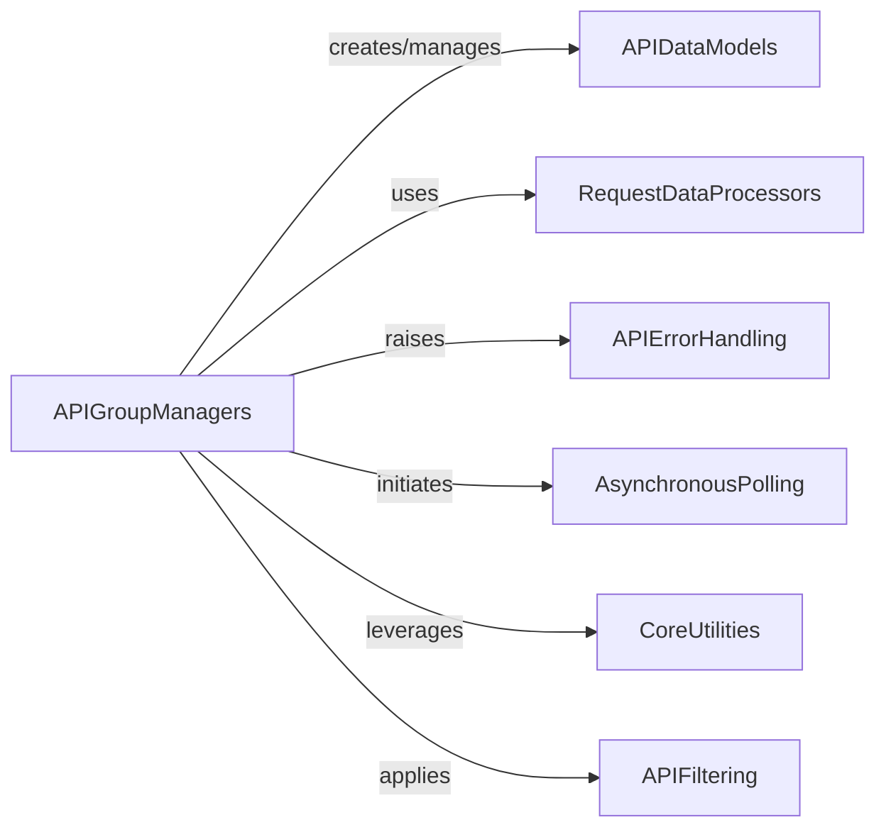

## Component Details

This component comprises classes that serve as the primary interface for interacting with specific Linode API resources. Each class within this component encapsulates methods for creating, retrieving, updating, and deleting resources related to a particular Linode service, such as Databases, Linodes, or Object Storage.

### APIGroupManagers
This component comprises classes that serve as the primary interface for interacting with specific Linode API resources. Each class within this component encapsulates methods for creating, retrieving, updating, and deleting resources related to a particular Linode service, such as Databases, Linodes, or Object Storage.

**Related Classes/Methods**:

- <a href="https://github.com/linode/python-linode-api/blob/master/linode_api4/groups/linode.py#L29-L451" target="_blank" rel="noopener noreferrer">`linode_api4.groups.linode.LinodeGroup` (29:451)</a>
- <a href="https://github.com/linode/python-linode-api/blob/master/linode_api4/groups/profile.py#L18-L345" target="_blank" rel="noopener noreferrer">`linode_api4.groups.profile.ProfileGroup` (18:345)</a>
- <a href="https://github.com/linode/python-linode-api/blob/master/linode_api4/groups/account.py#L24-L512" target="_blank" rel="noopener noreferrer">`linode_api4.groups.account.AccountGroup` (24:512)</a>
- <a href="https://github.com/linode/python-linode-api/blob/master/linode_api4/groups/networking.py#L16-L396" target="_blank" rel="noopener noreferrer">`linode_api4.groups.networking.NetworkingGroup` (16:396)</a>
- <a href="https://github.com/linode/python-linode-api/blob/master/linode_api4/groups/support.py#L17-L105" target="_blank" rel="noopener noreferrer">`linode_api4.groups.support.SupportGroup` (17:105)</a>
- <a href="https://github.com/linode/python-linode-api/blob/master/linode_api4/groups/longview.py#L10-L107" target="_blank" rel="noopener noreferrer">`linode_api4.groups.longview.LongviewGroup` (10:107)</a>
- <a href="https://github.com/linode/python-linode-api/blob/master/linode_api4/groups/object_storage.py#L29-L535" target="_blank" rel="noopener noreferrer">`linode_api4.groups.object_storage.ObjectStorageGroup` (29:535)</a>
- <a href="https://github.com/linode/python-linode-api/blob/master/linode_api4/groups/lke.py#L17-L207" target="_blank" rel="noopener noreferrer">`linode_api4.groups.lke.LKEGroup` (17:207)</a>
- <a href="https://github.com/linode/python-linode-api/blob/master/linode_api4/groups/database.py#L20-L377" target="_blank" rel="noopener noreferrer">`linode_api4.groups.database.DatabaseGroup` (20:377)</a>
- <a href="https://github.com/linode/python-linode-api/blob/master/linode_api4/groups/nodebalancer.py#L6-L70" target="_blank" rel="noopener noreferrer">`linode_api4.groups.nodebalancer.NodeBalancerGroup` (6:70)</a>
- <a href="https://github.com/linode/python-linode-api/blob/master/linode_api4/groups/domain.py#L6-L61" target="_blank" rel="noopener noreferrer">`linode_api4.groups.domain.DomainGroup` (6:61)</a>
- <a href="https://github.com/linode/python-linode-api/blob/master/linode_api4/groups/tag.py#L6-L116" target="_blank" rel="noopener noreferrer">`linode_api4.groups.tag.TagGroup` (6:116)</a>
- <a href="https://github.com/linode/python-linode-api/blob/master/linode_api4/groups/volume.py#L7-L95" target="_blank" rel="noopener noreferrer">`linode_api4.groups.volume.VolumeGroup` (7:95)</a>
- <a href="https://github.com/linode/python-linode-api/blob/master/linode_api4/groups/region.py#L6-L45" target="_blank" rel="noopener noreferrer">`linode_api4.groups.region.RegionGroup` (6:45)</a>
- <a href="https://github.com/linode/python-linode-api/blob/master/linode_api4/groups/image.py#L12-L173" target="_blank" rel="noopener noreferrer">`linode_api4.groups.image.ImageGroup` (12:173)</a>
- <a href="https://github.com/linode/python-linode-api/blob/master/linode_api4/groups/vpc.py#L9-L104" target="_blank" rel="noopener noreferrer">`linode_api4.groups.vpc.VPCGroup` (9:104)</a>
- <a href="https://github.com/linode/python-linode-api/blob/master/linode_api4/groups/polling.py#L9-L91" target="_blank" rel="noopener noreferrer">`linode_api4.groups.polling.PollingGroup` (9:91)</a>
- <a href="https://github.com/linode/python-linode-api/blob/master/linode_api4/groups/beta.py#L5-L24" target="_blank" rel="noopener noreferrer">`linode_api4.groups.beta.BetaProgramGroup` (5:24)</a>
- <a href="https://github.com/linode/python-linode-api/blob/master/linode_api4/groups/placement.py#L13-L76" target="_blank" rel="noopener noreferrer">`linode_api4.groups.placement.PlacementAPIGroup` (13:76)</a>
- <a href="https://github.com/linode/python-linode-api/blob/master/linode_api4/groups/monitor.py#L19-L153" target="_blank" rel="noopener noreferrer">`linode_api4.groups.monitor.MonitorGroup` (19:153)</a>
- <a href="https://github.com/linode/python-linode-api/blob/master/linode_api4/groups/lke_tier.py#L5-L40" target="_blank" rel="noopener noreferrer">`linode_api4.groups.lke_tier.LKETierGroup` (5:40)</a>

### APIDataModels
This component consists of classes that represent the various data structures and entities returned by the Linode API. Instances of these classes hold the retrieved API data and may include methods for further interaction or manipulation of that data.

**Related Classes/Methods**:

- <a href="https://github.com/linode/python-linode-api/blob/master/linode_api4/objects/placement.py#L57-L128" target="_blank" rel="noopener noreferrer">`linode_api4.objects.placement.PlacementGroup` (57:128)</a>
- <a href="https://github.com/linode/python-linode-api/blob/master/linode_api4/objects/database.py#L274-L436" target="_blank" rel="noopener noreferrer">`linode_api4.objects.database.MySQLDatabase` (274:436)</a>
- <a href="https://github.com/linode/python-linode-api/blob/master/linode_api4/objects/database.py#L439-L603" target="_blank" rel="noopener noreferrer">`linode_api4.objects.database.PostgreSQLDatabase` (439:603)</a>
- <a href="https://github.com/linode/python-linode-api/blob/master/linode_api4/objects/tag.py#L19-L79" target="_blank" rel="noopener noreferrer">`linode_api4.objects.tag.Tag` (19:79)</a>
- <a href="https://github.com/linode/python-linode-api/blob/master/linode_api4/objects/volume.py#L31-L147" target="_blank" rel="noopener noreferrer">`linode_api4.objects.volume.Volume` (31:147)</a>
- <a href="https://github.com/linode/python-linode-api/blob/master/linode_api4/objects/object_storage.py#L561-L578" target="_blank" rel="noopener noreferrer">`linode_api4.objects.object_storage.ObjectStorageKeys` (561:578)</a>
- <a href="https://github.com/linode/python-linode-api/blob/master/linode_api4/objects/base.py#L73-L144" target="_blank" rel="noopener noreferrer">`linode_api4.objects.base.MappedObject` (73:144)</a>
- <a href="https://github.com/linode/python-linode-api/blob/master/linode_api4/objects/object_storage.py#L82-L502" target="_blank" rel="noopener noreferrer">`linode_api4.objects.object_storage.ObjectStorageBucket` (82:502)</a>
- <a href="https://github.com/linode/python-linode-api/blob/master/linode_api4/objects/support.py#L39-L190" target="_blank" rel="noopener noreferrer">`linode_api4.objects.support.SupportTicket` (39:190)</a>
- <a href="https://github.com/linode/python-linode-api/blob/master/linode_api4/objects/domain.py#L34-L160" target="_blank" rel="noopener noreferrer">`linode_api4.objects.domain.Domain` (34:160)</a>
- `linode_api4.objects.linode.Instance.generate_root_password` (full file reference)
- `linode_api4.objects.linode.Instance` (full file reference)
- `linode_api4.objects.linode.StackScript` (full file reference)
- <a href="https://github.com/linode/python-linode-api/blob/master/linode_api4/objects/monitor.py#L173-L180" target="_blank" rel="noopener noreferrer">`linode_api4.objects.monitor.MonitorServiceToken` (173:180)</a>
- <a href="https://github.com/linode/python-linode-api/blob/master/linode_api4/objects/account.py#L25-L56" target="_blank" rel="noopener noreferrer">`linode_api4.objects.account.Account` (25:56)</a>
- <a href="https://github.com/linode/python-linode-api/blob/master/linode_api4/objects/account.py#L204-L331" target="_blank" rel="noopener noreferrer">`linode_api4.objects.account.Event` (204:331)</a>
- <a href="https://github.com/linode/python-linode-api/blob/master/linode_api4/objects/account.py#L183-L201" target="_blank" rel="noopener noreferrer">`linode_api4.objects.account.AccountSettings` (183:201)</a>
- <a href="https://github.com/linode/python-linode-api/blob/master/linode_api4/objects/account.py#L390-L488" target="_blank" rel="noopener noreferrer">`linode_api4.objects.account.OAuthClient` (390:488)</a>
- <a href="https://github.com/linode/python-linode-api/blob/master/linode_api4/objects/account.py#L507-L555" target="_blank" rel="noopener noreferrer">`linode_api4.objects.account.User` (507:555)</a>
- <a href="https://github.com/linode/python-linode-api/blob/master/linode_api4/objects/lke.py#L267-L639" target="_blank" rel="noopener noreferrer">`linode_api4.objects.lke.LKECluster` (267:639)</a>
- <a href="https://github.com/linode/python-linode-api/blob/master/linode_api4/objects/image.py#L33-L89" target="_blank" rel="noopener noreferrer">`linode_api4.objects.image.Image` (33:89)</a>
- <a href="https://github.com/linode/python-linode-api/blob/master/linode_api4/objects/nodebalancer.py#L232-L357" target="_blank" rel="noopener noreferrer">`linode_api4.objects.nodebalancer.NodeBalancer` (232:357)</a>
- <a href="https://github.com/linode/python-linode-api/blob/master/linode_api4/objects/longview.py#L4-L21" target="_blank" rel="noopener noreferrer">`linode_api4.objects.longview.LongviewClient` (4:21)</a>
- <a href="https://github.com/linode/python-linode-api/blob/master/linode_api4/objects/longview.py#L41-L55" target="_blank" rel="noopener noreferrer">`linode_api4.objects.longview.LongviewPlan` (41:55)</a>
- <a href="https://github.com/linode/python-linode-api/blob/master/linode_api4/objects/vpc.py#L44-L116" target="_blank" rel="noopener noreferrer">`linode_api4.objects.vpc.VPC` (44:116)</a>
- <a href="https://github.com/linode/python-linode-api/blob/master/linode_api4/objects/profile.py#L59-L186" target="_blank" rel="noopener noreferrer">`linode_api4.objects.profile.Profile` (59:186)</a>
- <a href="https://github.com/linode/python-linode-api/blob/master/linode_api4/objects/profile.py#L25-L41" target="_blank" rel="noopener noreferrer">`linode_api4.objects.profile.PersonalAccessToken` (25:41)</a>
- <a href="https://github.com/linode/python-linode-api/blob/master/linode_api4/objects/profile.py#L189-L203" target="_blank" rel="noopener noreferrer">`linode_api4.objects.profile.SSHKey` (189:203)</a>
- <a href="https://github.com/linode/python-linode-api/blob/master/linode_api4/objects/networking.py#L198-L307" target="_blank" rel="noopener noreferrer">`linode_api4.objects.networking.Firewall` (198:307)</a>
- <a href="https://github.com/linode/python-linode-api/blob/master/linode_api4/objects/networking.py#L60-L127" target="_blank" rel="noopener noreferrer">`linode_api4.objects.networking.IPAddress` (60:127)</a>

### RequestDataProcessors
This component includes utility functions responsible for preparing and transforming request bodies before they are sent to the Linode API. This often involves flattening nested data structures or removing null values to conform to API requirements.

**Related Classes/Methods**:

- <a href="https://github.com/linode/python-linode-api/blob/master/linode_api4/objects/base.py#L509-L535" target="_blank" rel="noopener noreferrer">`linode_api4.objects.base._flatten_request_body_recursive` (509:535)</a>
- <a href="https://github.com/linode/python-linode-api/blob/master/linode_api4/util.py#L8-L29" target="_blank" rel="noopener noreferrer">`linode_api4.util.drop_null_keys` (8:29)</a>
- `linode_api4.objects.linode._expand_placement_group_assignment` (full file reference)

### APIErrorHandling
This component is dedicated to managing and raising exceptions that occur during interactions with the Linode API. It provides a standardized way to signal unexpected responses or errors encountered during API calls.

**Related Classes/Methods**:

- <a href="https://github.com/linode/python-linode-api/blob/master/linode_api4/errors.py#L103-L149" target="_blank" rel="noopener noreferrer">`linode_api4.errors.UnexpectedResponseError` (103:149)</a>

### AsynchronousPolling
This component provides mechanisms for asynchronously monitoring the status of Linode resources or events. It includes classes and functions for creating event pollers and managing timeouts while waiting for specific conditions to be met.

**Related Classes/Methods**:

- <a href="https://github.com/linode/python-linode-api/blob/master/linode_api4/polling.py#L97-L250" target="_blank" rel="noopener noreferrer">`linode_api4.polling.EventPoller` (97:250)</a>
- <a href="https://github.com/linode/python-linode-api/blob/master/linode_api4/polling.py#L29-L94" target="_blank" rel="noopener noreferrer">`linode_api4.polling.TimeoutContext` (29:94)</a>
- `linode_api4.groups.polling.PollingGroup.wait_for_entity_free.poll_func` (full file reference)

### CoreUtilities
This component encompasses general-purpose utility functions that are utilized across various parts of the Linode API client. These utilities provide common functionalities like key validation or other helper operations.

**Related Classes/Methods**:

- <a href="https://github.com/linode/python-linode-api/blob/master/linode_api4/common.py#L16-L62" target="_blank" rel="noopener noreferrer">`linode_api4.common.load_and_validate_keys` (16:62)</a>

### APIFiltering
This component provides the functionality for constructing and applying filters to retrieve specific subsets of data from Linode API collections. It enables users to refine their API queries based on various criteria.

**Related Classes/Methods**:

- <a href="https://github.com/linode/python-linode-api/blob/master/linode_api4/objects/filtering.py#L122-L173" target="_blank" rel="noopener noreferrer">`linode_api4.objects.filtering.Filter` (122:173)</a>

### [FAQ](https://github.com/CodeBoarding/GeneratedOnBoardings/tree/main?tab=readme-ov-file#faq)