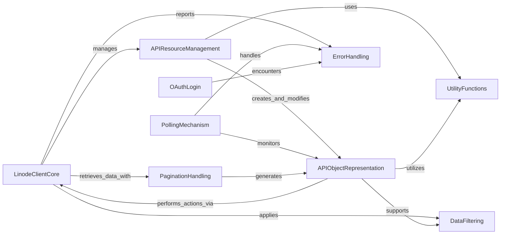

## Component Details

This section of the Linode API client library provides a comprehensive suite of utility components designed to streamline various aspects of API interaction. It encompasses mechanisms for asynchronous event polling, secure user authentication via OAuth, efficient handling of large datasets through pagination, flexible data retrieval using advanced filtering capabilities, and a collection of general-purpose helper functions. Together, these components abstract away common complexities, enabling developers to build robust and efficient applications that interact seamlessly with the Linode API.

### LinodeClientCore
This component serves as the primary interface for interacting with the Linode API. It manages authentication, constructs API requests, handles responses, and provides methods for retrieving single or paginated lists of API objects. It also incorporates retry logic for transient errors.

**Related Classes/Methods**:

- <a href="https://github.com/linode/python-linode-api/blob/master/linode_api4/linode_client.py#L54-L488" target="_blank" rel="noopener noreferrer">`python-linode-api.linode_api4.linode_client.LinodeClient` (54:488)</a>
- <a href="https://github.com/linode/python-linode-api/blob/master/linode_api4/linode_client.py#L304-L333" target="_blank" rel="noopener noreferrer">`python-linode-api.linode_api4.linode_client.LinodeClient:_get_objects` (304:333)</a>
- <a href="https://github.com/linode/python-linode-api/blob/master/linode_api4/linode_client.py#L461-L488" target="_blank" rel="noopener noreferrer">`python-linode-api.linode_api4.linode_client.LinodeClient:_get_and_filter` (461:488)</a>

### APIResourceManagement
This component comprises various "group" classes that provide a structured way to interact with different categories of Linode API resources. Each group offers methods tailored to the management of its respective resource type, abstracting away the underlying API endpoints and request complexities.

**Related Classes/Methods**:

- <a href="https://github.com/linode/python-linode-api/blob/master/linode_api4/groups/database.py#L20-L377" target="_blank" rel="noopener noreferrer">`python-linode-api.linode_api4.groups.database.DatabaseGroup` (20:377)</a>
- <a href="https://github.com/linode/python-linode-api/blob/master/linode_api4/groups/volume.py#L7-L95" target="_blank" rel="noopener noreferrer">`python-linode-api.linode_api4.groups.volume.VolumeGroup` (7:95)</a>
- <a href="https://github.com/linode/python-linode-api/blob/master/linode_api4/groups/object_storage.py#L29-L535" target="_blank" rel="noopener noreferrer">`python-linode-api.linode_api4.groups.object_storage.ObjectStorageGroup` (29:535)</a>
- <a href="https://github.com/linode/python-linode-api/blob/master/linode_api4/groups/linode.py#L29-L451" target="_blank" rel="noopener noreferrer">`python-linode-api.linode_api4.groups.linode.LinodeGroup` (29:451)</a>
- <a href="https://github.com/linode/python-linode-api/blob/master/linode_api4/groups/lke.py#L17-L207" target="_blank" rel="noopener noreferrer">`python-linode-api.linode_api4.groups.lke.LKEGroup` (17:207)</a>
- <a href="https://github.com/linode/python-linode-api/blob/master/linode_api4/groups/image.py#L12-L173" target="_blank" rel="noopener noreferrer">`python-linode-api.linode_api4.groups.image.ImageGroup` (12:173)</a>
- <a href="https://github.com/linode/python-linode-api/blob/master/linode_api4/groups/database.py#L122-L184" target="_blank" rel="noopener noreferrer">`python-linode-api.linode_api4.groups.database.DatabaseGroup:mysql_create` (122:184)</a>
- <a href="https://github.com/linode/python-linode-api/blob/master/linode_api4/groups/database.py#L186-L239" target="_blank" rel="noopener noreferrer">`python-linode-api.linode_api4.groups.database.DatabaseGroup:mysql_fork` (186:239)</a>
- <a href="https://github.com/linode/python-linode-api/blob/master/linode_api4/groups/database.py#L256-L321" target="_blank" rel="noopener noreferrer">`python-linode-api.linode_api4.groups.database.DatabaseGroup:postgresql_create` (256:321)</a>
- <a href="https://github.com/linode/python-linode-api/blob/master/linode_api4/groups/database.py#L323-L377" target="_blank" rel="noopener noreferrer">`python-linode-api.linode_api4.groups.database.DatabaseGroup:postgresql_fork` (323:377)</a>
- <a href="https://github.com/linode/python-linode-api/blob/master/linode_api4/groups/volume.py#L28-L77" target="_blank" rel="noopener noreferrer">`python-linode-api.linode_api4.groups.volume.VolumeGroup:create` (28:77)</a>
- <a href="https://github.com/linode/python-linode-api/blob/master/linode_api4/groups/object_storage.py#L447-L520" target="_blank" rel="noopener noreferrer">`python-linode-api.linode_api4.groups.object_storage.ObjectStorageGroup:object_url_create` (447:520)</a>
- <a href="https://github.com/linode/python-linode-api/blob/master/linode_api4/groups/linode.py#L78-L117" target="_blank" rel="noopener noreferrer">`python-linode-api.linode_api4.groups.linode.LinodeGroup:stackscripts` (78:117)</a>
- <a href="https://github.com/linode/python-linode-api/blob/master/linode_api4/groups/linode.py#L136-L356" target="_blank" rel="noopener noreferrer">`python-linode-api.linode_api4.groups.linode.LinodeGroup:instance_create` (136:356)</a>
- <a href="https://github.com/linode/python-linode-api/blob/master/linode_api4/groups/lke.py#L61-L149" target="_blank" rel="noopener noreferrer">`python-linode-api.linode_api4.groups.lke.LKEGroup:cluster_create` (61:149)</a>
- <a href="https://github.com/linode/python-linode-api/blob/master/linode_api4/groups/image.py#L33-L83" target="_blank" rel="noopener noreferrer">`python-linode-api.linode_api4.groups.image.ImageGroup:create` (33:83)</a>
- <a href="https://github.com/linode/python-linode-api/blob/master/linode_api4/groups/image.py#L85-L132" target="_blank" rel="noopener noreferrer">`python-linode-api.linode_api4.groups.image.ImageGroup:create_upload` (85:132)</a>

### APIObjectRepresentation
This component consists of classes that mirror the structure and behavior of resources available through the Linode API. Instances of these classes allow developers to interact with Linode entities (like Linode instances, disks, volumes, or LKE clusters) as Python objects, providing methods for actions specific to each resource.

**Related Classes/Methods**:

- <a href="https://github.com/linode/python-linode-api/blob/master/linode_api4/objects/tag.py#L19-L79" target="_blank" rel="noopener noreferrer">`python-linode-api.linode_api4.objects.tag.Tag` (19:79)</a>
- <a href="https://github.com/linode/python-linode-api/blob/master/linode_api4/objects/volume.py#L31-L147" target="_blank" rel="noopener noreferrer">`python-linode-api.linode_api4.objects.volume.Volume` (31:147)</a>
- <a href="https://github.com/linode/python-linode-api/blob/master/linode_api4/objects/object_storage.py#L82-L502" target="_blank" rel="noopener noreferrer">`python-linode-api.linode_api4.objects.object_storage.ObjectStorageBucket` (82:502)</a>
- `python-linode-api.linode_api4.objects.linode.Disk` (full file reference)
- `python-linode-api.linode_api4.objects.linode.Instance` (full file reference)
- <a href="https://github.com/linode/python-linode-api/blob/master/linode_api4/objects/lke.py#L267-L639" target="_blank" rel="noopener noreferrer">`python-linode-api.linode_api4.objects.lke.LKECluster` (267:639)</a>
- <a href="https://github.com/linode/python-linode-api/blob/master/linode_api4/objects/lke.py#L173-L264" target="_blank" rel="noopener noreferrer">`python-linode-api.linode_api4.objects.lke.LKENodePool` (173:264)</a>
- <a href="https://github.com/linode/python-linode-api/blob/master/linode_api4/objects/account.py#L204-L331" target="_blank" rel="noopener noreferrer">`linode_api4.objects.account.Event` (204:331)</a>
- <a href="https://github.com/linode/python-linode-api/blob/master/linode_api4/objects/base.py#L147-L506" target="_blank" rel="noopener noreferrer">`linode_api4.objects.base.Base` (147:506)</a>
- <a href="https://github.com/linode/python-linode-api/blob/master/linode_api4/objects/base.py#L73-L144" target="_blank" rel="noopener noreferrer">`linode_api4.objects.base.MappedObject` (73:144)</a>
- <a href="https://github.com/linode/python-linode-api/blob/master/linode_api4/objects/database.py#L274-L436" target="_blank" rel="noopener noreferrer">`linode_api4.objects.database.MySQLDatabase` (274:436)</a>
- <a href="https://github.com/linode/python-linode-api/blob/master/linode_api4/objects/database.py#L439-L603" target="_blank" rel="noopener noreferrer">`linode_api4.objects.database.PostgreSQLDatabase` (439:603)</a>
- <a href="https://github.com/linode/python-linode-api/blob/master/linode_api4/objects/image.py#L33-L89" target="_blank" rel="noopener noreferrer">`linode_api4.objects.image.Image` (33:89)</a>
- <a href="https://github.com/linode/python-linode-api/blob/master/linode_api4/objects/tag.py#L62-L79" target="_blank" rel="noopener noreferrer">`python-linode-api.linode_api4.objects.tag.Tag:objects` (62:79)</a>
- <a href="https://github.com/linode/python-linode-api/blob/master/linode_api4/objects/volume.py#L57-L89" target="_blank" rel="noopener noreferrer">`python-linode-api.linode_api4.objects.volume.Volume:attach` (57:89)</a>
- <a href="https://github.com/linode/python-linode-api/blob/master/linode_api4/objects/object_storage.py#L154-L193" target="_blank" rel="noopener noreferrer">`python-linode-api.linode_api4.objects.object_storage.ObjectStorageBucket:access_modify` (154:193)</a>
- <a href="https://github.com/linode/python-linode-api/blob/master/linode_api4/objects/object_storage.py#L195-L234" target="_blank" rel="noopener noreferrer">`python-linode-api.linode_api4.objects.object_storage.ObjectStorageBucket:access_update` (195:234)</a>
- <a href="https://github.com/linode/python-linode-api/blob/master/linode_api4/objects/object_storage.py#L327-L391" target="_blank" rel="noopener noreferrer">`python-linode-api.linode_api4.objects.object_storage.ObjectStorageBucket:contents` (327:391)</a>
- <a href="https://github.com/linode/python-linode-api/blob/master/linode_api4/objects/object_storage.py#L393-L428" target="_blank" rel="noopener noreferrer">`python-linode-api.linode_api4.objects.object_storage.ObjectStorageBucket:object_acl_config` (393:428)</a>
- `python-linode-api.linode_api4.objects.linode.Disk:reset_root_password` (full file reference)
- `python-linode-api.linode_api4.objects.linode.Instance:reset_instance_root_password` (full file reference)
- `python-linode-api.linode_api4.objects.linode.Instance:generate_root_password` (full file reference)
- `python-linode-api.linode_api4.objects.linode.Instance:disk_create` (full file reference)
- `python-linode-api.linode_api4.objects.linode.Instance:rebuild` (full file reference)
- `python-linode-api.linode_api4.objects.linode.Instance:initiate_migration` (full file reference)
- `python-linode-api.linode_api4.objects.linode.Instance:clone` (full file reference)
- <a href="https://github.com/linode/python-linode-api/blob/master/linode_api4/objects/lke.py#L412-L478" target="_blank" rel="noopener noreferrer">`python-linode-api.linode_api4.objects.lke.LKECluster:node_pool_create` (412:478)</a>
- <a href="https://github.com/linode/python-linode-api/blob/master/linode_api4/objects/lke.py#L596-L623" target="_blank" rel="noopener noreferrer">`python-linode-api.linode_api4.objects.lke.LKECluster:control_plane_acl_update` (596:623)</a>

### DataFiltering
This component offers a flexible mechanism for filtering data returned by the Linode API. It includes classes and methods that enable the creation of complex filter expressions, which can then be applied to API requests to narrow down results based on specific criteria.

**Related Classes/Methods**:

- <a href="https://github.com/linode/python-linode-api/blob/master/linode_api4/objects/filtering.py#L85-L102" target="_blank" rel="noopener noreferrer">`python-linode-api.linode_api4.objects.filtering:order_by` (85:102)</a>
- <a href="https://github.com/linode/python-linode-api/blob/master/linode_api4/objects/filtering.py#L105-L119" target="_blank" rel="noopener noreferrer">`python-linode-api.linode_api4.objects.filtering:limit` (105:119)</a>
- <a href="https://github.com/linode/python-linode-api/blob/master/linode_api4/objects/filtering.py#L133-L139" target="_blank" rel="noopener noreferrer">`python-linode-api.linode_api4.objects.filtering.Filter:__or__` (133:139)</a>
- <a href="https://github.com/linode/python-linode-api/blob/master/linode_api4/objects/filtering.py#L141-L147" target="_blank" rel="noopener noreferrer">`python-linode-api.linode_api4.objects.filtering.Filter:__and__` (141:147)</a>
- <a href="https://github.com/linode/python-linode-api/blob/master/linode_api4/objects/filtering.py#L180-L181" target="_blank" rel="noopener noreferrer">`python-linode-api.linode_api4.objects.filtering.FilterableAttribute:__eq__` (180:181)</a>
- <a href="https://github.com/linode/python-linode-api/blob/master/linode_api4/objects/filtering.py#L183-L184" target="_blank" rel="noopener noreferrer">`python-linode-api.linode_api4.objects.filtering.FilterableAttribute:__ne__` (183:184)</a>
- <a href="https://github.com/linode/python-linode-api/blob/master/linode_api4/objects/filtering.py#L188-L189" target="_blank" rel="noopener noreferrer">`python-linode-api.linode_api4.objects.filtering.FilterableAttribute:contains` (188:189)</a>
- <a href="https://github.com/linode/python-linode-api/blob/master/linode_api4/objects/filtering.py#L191-L192" target="_blank" rel="noopener noreferrer">`python-linode-api.linode_api4.objects.filtering.FilterableAttribute:__gt__` (191:192)</a>
- <a href="https://github.com/linode/python-linode-api/blob/master/linode_api4/objects/filtering.py#L194-L195" target="_blank" rel="noopener noreferrer">`python-linode-api.linode_api4.objects.filtering.FilterableAttribute:__lt__` (194:195)</a>
- <a href="https://github.com/linode/python-linode-api/blob/master/linode_api4/objects/filtering.py#L197-L198" target="_blank" rel="noopener noreferrer">`python-linode-api.linode_api4.objects.filtering.FilterableAttribute:__ge__` (197:198)</a>
- <a href="https://github.com/linode/python-linode-api/blob/master/linode_api4/objects/filtering.py#L200-L201" target="_blank" rel="noopener noreferrer">`python-linode-api.linode_api4.objects.filtering.FilterableAttribute:__le__` (200:201)</a>
- <a href="https://github.com/linode/python-linode-api/blob/master/linode_api4/objects/filtering.py#L246-L251" target="_blank" rel="noopener noreferrer">`python-linode-api.linode_api4.objects.filtering.FilterableMetaclass:__init__` (246:251)</a>
- <a href="https://github.com/linode/python-linode-api/blob/master/linode_api4/objects/serializable.py#L27-L39" target="_blank" rel="noopener noreferrer">`python-linode-api.linode_api4.objects.serializable.JSONFilterableMetaclass:__init__` (27:39)</a>
- <a href="https://github.com/linode/python-linode-api/blob/master/linode_api4/objects/filtering.py#L69-L82" target="_blank" rel="noopener noreferrer">`linode_api4.objects.filtering.and_` (69:82)</a>
- <a href="https://github.com/linode/python-linode-api/blob/master/linode_api4/objects/filtering.py#L122-L173" target="_blank" rel="noopener noreferrer">`linode_api4.objects.filtering.Filter` (122:173)</a>

### PaginationHandling
This component is responsible for abstracting the complexities of paginated API responses. It provides methods to construct and manage lists of objects that are retrieved in pages from the API, allowing for seamless iteration over potentially large collections of resources.

**Related Classes/Methods**:

- <a href="https://github.com/linode/python-linode-api/blob/master/linode_api4/paginated_list.py#L6-L262" target="_blank" rel="noopener noreferrer">`python-linode-api.linode_api4.paginated_list.PaginatedList` (6:262)</a>
- <a href="https://github.com/linode/python-linode-api/blob/master/linode_api4/paginated_list.py#L100-L119" target="_blank" rel="noopener noreferrer">`python-linode-api.linode_api4.paginated_list.PaginatedList:_load_page` (100:119)</a>
- <a href="https://github.com/linode/python-linode-api/blob/master/linode_api4/paginated_list.py#L121-L141" target="_blank" rel="noopener noreferrer">`python-linode-api.linode_api4.paginated_list.PaginatedList:__getitem__` (121:141)</a>
- <a href="https://github.com/linode/python-linode-api/blob/master/linode_api4/paginated_list.py#L230-L262" target="_blank" rel="noopener noreferrer">`python-linode-api.linode_api4.paginated_list.PaginatedList:make_paginated_list` (230:262)</a>
- <a href="https://github.com/linode/python-linode-api/blob/master/linode_api4/paginated_list.py#L195-L227" target="_blank" rel="noopener noreferrer">`python-linode-api.linode_api4.paginated_list.PaginatedList:make_list` (195:227)</a>

### PollingMechanism
This component provides functionality for asynchronously monitoring the status of Linode API events or entities. It allows the client to wait for specific conditions to be met, such as an event completing or an entity transitioning to a desired state, without blocking the main application thread.

**Related Classes/Methods**:

- <a href="https://github.com/linode/python-linode-api/blob/master/linode_api4/polling.py#L97-L250" target="_blank" rel="noopener noreferrer">`python-linode-api.linode_api4.polling.EventPoller` (97:250)</a>
- <a href="https://github.com/linode/python-linode-api/blob/master/linode_api4/polling.py#L102-L122" target="_blank" rel="noopener noreferrer">`python-linode-api.linode_api4.polling.EventPoller:__init__` (102:122)</a>
- <a href="https://github.com/linode/python-linode-api/blob/master/linode_api4/polling.py#L171-L213" target="_blank" rel="noopener noreferrer">`python-linode-api.linode_api4.polling.EventPoller:wait_for_next_event` (171:213)</a>
- <a href="https://github.com/linode/python-linode-api/blob/master/linode_api4/polling.py#L215-L250" target="_blank" rel="noopener noreferrer">`python-linode-api.linode_api4.polling.EventPoller:wait_for_next_event_finished` (215:250)</a>
- <a href="https://github.com/linode/python-linode-api/blob/master/linode_api4/groups/polling.py#L14-L43" target="_blank" rel="noopener noreferrer">`python-linode-api.linode_api4.groups.polling.PollingGroup:event_poller_create` (14:43)</a>
- <a href="https://github.com/linode/python-linode-api/blob/master/linode_api4/groups/polling.py#L45-L91" target="_blank" rel="noopener noreferrer">`python-linode-api.linode_api4.groups.polling.PollingGroup:wait_for_entity_free` (45:91)</a>
- <a href="https://github.com/linode/python-linode-api/blob/master/linode_api4/polling.py#L29-L94" target="_blank" rel="noopener noreferrer">`python-linode-api.linode_api4.polling.TimeoutContext` (29:94)</a>

### OAuthLogin
This component manages the process of authenticating users with the Linode API using OAuth 2.0. It provides methods for generating login URLs, exchanging authorization codes for access tokens, and refreshing expired tokens, ensuring secure user access.

**Related Classes/Methods**:

- <a href="https://github.com/linode/python-linode-api/blob/master/linode_api4/login_client.py#L277-L299" target="_blank" rel="noopener noreferrer">`python-linode-api.linode_api4.login_client.OAuthScopes:parse` (277:299)</a>
- <a href="https://github.com/linode/python-linode-api/blob/master/linode_api4/login_client.py#L357-L391" target="_blank" rel="noopener noreferrer">`python-linode-api.linode_api4.login_client.LinodeLoginClient:generate_login_url` (357:391)</a>
- <a href="https://github.com/linode/python-linode-api/blob/master/linode_api4/login_client.py#L393-L447" target="_blank" rel="noopener noreferrer">`python-linode-api.linode_api4.login_client.LinodeLoginClient:finish_oauth` (393:447)</a>
- <a href="https://github.com/linode/python-linode-api/blob/master/linode_api4/login_client.py#L449-L488" target="_blank" rel="noopener noreferrer">`python-linode-api.linode_api4.login_client.LinodeLoginClient:refresh_oauth_token` (449:488)</a>
- <a href="https://github.com/linode/python-linode-api/blob/master/linode_api4/login_client.py#L490-L519" target="_blank" rel="noopener noreferrer">`python-linode-api.linode_api4.login_client.LinodeLoginClient:expire_token` (490:519)</a>
- <a href="https://github.com/linode/python-linode-api/blob/master/linode_api4/login_client.py#L325-L519" target="_blank" rel="noopener noreferrer">`python-linode-api.linode_api4.login_client.LinodeLoginClient` (325:519)</a>
- <a href="https://github.com/linode/python-linode-api/blob/master/linode_api4/login_client.py#L22-L322" target="_blank" rel="noopener noreferrer">`python-linode-api.linode_api4.login_client.OAuthScopes` (22:322)</a>

### UtilityFunctions
This component groups various utility functions that perform common tasks such as data manipulation (e.g., removing null keys from dictionaries) or password generation. These functions support the broader functionality of the Linode API client.

**Related Classes/Methods**:

- <a href="https://github.com/linode/python-linode-api/blob/master/linode_api4/util.py#L8-L29" target="_blank" rel="noopener noreferrer">`python-linode-api.linode_api4.util:drop_null_keys` (8:29)</a>
- <a href="https://github.com/linode/python-linode-api/blob/master/linode_api4/objects/base.py#L509-L535" target="_blank" rel="noopener noreferrer">`linode_api4.objects.base._flatten_request_body_recursive` (509:535)</a>
- <a href="https://github.com/linode/python-linode-api/blob/master/linode_api4/common.py#L16-L62" target="_blank" rel="noopener noreferrer">`linode_api4.common.load_and_validate_keys` (16:62)</a>
- `python-linode-api.linode_api4.objects.linode.Instance.generate_root_password._func` (full file reference)
- `python-linode-api.linode_api4.objects.linode._expand_placement_group_assignment` (full file reference)

### ErrorHandling
This component defines custom exception types and utility methods for parsing and raising errors encountered during interactions with the Linode API. It ensures that API-specific error messages are properly captured and communicated to the user.

**Related Classes/Methods**:

- <a href="https://github.com/linode/python-linode-api/blob/master/linode_api4/errors.py#L37-L100" target="_blank" rel="noopener noreferrer">`linode_api4.errors.ApiError.from_response` (37:100)</a>
- <a href="https://github.com/linode/python-linode-api/blob/master/linode_api4/errors.py#L103-L149" target="_blank" rel="noopener noreferrer">`linode_api4.errors.UnexpectedResponseError` (103:149)</a>
- <a href="https://github.com/linode/python-linode-api/blob/master/linode_api4/polling.py#L9-L26" target="_blank" rel="noopener noreferrer">`python-linode-api.linode_api4.polling.EventError` (9:26)</a>

### [FAQ](https://github.com/CodeBoarding/GeneratedOnBoardings/tree/main?tab=readme-ov-file#faq)