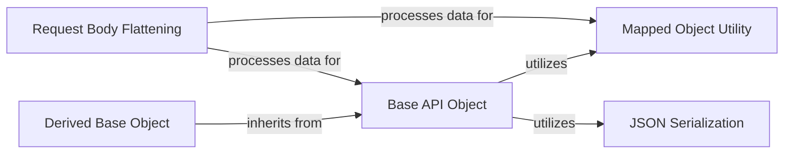

## Component Details

This component overview describes the fundamental abstract classes that define the common structure and behavior for all Linode API resources. It covers object instantiation, attribute management, and basic serialization/deserialization, providing a foundational layer for interacting with the Linode API.

### Base API Object
The Base API Object component provides fundamental functionalities for interacting with the Linode API. It handles lazy loading of object properties, saving mutable values to the server via PUT requests, deleting objects, and invalidating cached data to force re-fetching from the server. It also manages relationships with other API objects.

**Related Classes/Methods**:

- <a href="https://github.com/linode/python-linode-api/blob/master/linode_api4/objects/base.py#L147-L506" target="_blank" rel="noopener noreferrer">`linode_api4.objects.base.Base` (147:506)</a>

### Mapped Object Utility
The Mapped Object Utility provides a way to convert dictionaries into objects where dictionary keys can be accessed as object attributes using dot notation. It also handles recursive conversion of nested dictionaries and lists of dictionaries into MappedObject instances, and provides serialization capabilities for these objects.

**Related Classes/Methods**:

- <a href="https://github.com/linode/python-linode-api/blob/master/linode_api4/objects/base.py#L73-L144" target="_blank" rel="noopener noreferrer">`linode_api4.objects.base.MappedObject` (73:144)</a>

### JSON Serialization
The JSON Serialization component is responsible for converting Python objects to and from JSON format. It provides methods for unwrapping types, parsing attributes from JSON, and serializing objects into a dictionary representation suitable for JSON output.

**Related Classes/Methods**:

- <a href="https://github.com/linode/python-linode-api/blob/master/linode_api4/objects/serializable.py#L43-L258" target="_blank" rel="noopener noreferrer">`linode_api4.objects.serializable.JSONObject` (43:258)</a>
- <a href="https://github.com/linode/python-linode-api/blob/master/linode_api4/objects/serializable.py#L26-L39" target="_blank" rel="noopener noreferrer">`linode_api4.objects.serializable.JSONFilterableMetaclass` (26:39)</a>

### Request Body Flattening
This utility function recursively flattens data structures (dictionaries and lists) for use in API request bodies. It ensures that nested objects, including Base API Objects and Mapped Objects, are correctly serialized into their appropriate ID or dictionary representations before being sent in a request.

**Related Classes/Methods**:

- <a href="https://github.com/linode/python-linode-api/blob/master/linode_api4/objects/base.py#L509-L535" target="_blank" rel="noopener noreferrer">`linode_api4.objects.base._flatten_request_body_recursive` (509:535)</a>

### Derived Base Object
The Derived Base Object serves as an abstract base class for API resources that inherit common functionalities from the Base API Object, providing a foundation for more specialized API entities.

**Related Classes/Methods**:

- <a href="https://github.com/linode/python-linode-api/blob/master/linode_api4/objects/dbase.py#L4-L27" target="_blank" rel="noopener noreferrer">`linode_api4.objects.dbase.DerivedBase` (4:27)</a>

### [FAQ](https://github.com/CodeBoarding/GeneratedOnBoardings/tree/main?tab=readme-ov-file#faq)