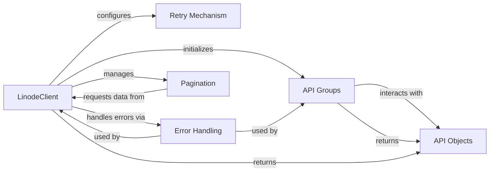

## Component Details

The Linode API Client subsystem provides a comprehensive interface for programmatic interaction with the Linode API. It centralizes authentication, request execution, and response handling through the `LinodeClient`, which orchestrates API calls and manages various API resource groups. The system incorporates robust error handling, a retry mechanism for transient failures, and efficient pagination for large datasets, ensuring reliable and structured access to Linode resources represented as `API Objects`.

### LinodeClient
The central component for interacting with the Linode API, handling authentication, request execution, response handling, and retry mechanisms. It orchestrates all API interactions and initializes various API group objects.

**Related Classes/Methods**:

- <a href="https://github.com/linode/python-linode-api/blob/master/linode_api4/linode_client.py#L54-L488" target="_blank" rel="noopener noreferrer">`python-linode-api.linode_api4.linode_client.LinodeClient` (54:488)</a>
- <a href="https://github.com/linode/python-linode-api/blob/master/linode_api4/linode_client.py#L250-L302" target="_blank" rel="noopener noreferrer">`python-linode-api.linode_api4.linode_client.LinodeClient:_api_call` (250:302)</a>
- <a href="https://github.com/linode/python-linode-api/blob/master/linode_api4/linode_client.py#L304-L333" target="_blank" rel="noopener noreferrer">`python-linode-api.linode_api4.linode_client.LinodeClient:_get_objects` (304:333)</a>
- <a href="https://github.com/linode/python-linode-api/blob/master/linode_api4/linode_client.py#L335-L336" target="_blank" rel="noopener noreferrer">`python-linode-api.linode_api4.linode_client.LinodeClient:get` (335:336)</a>
- <a href="https://github.com/linode/python-linode-api/blob/master/linode_api4/linode_client.py#L338-L339" target="_blank" rel="noopener noreferrer">`python-linode-api.linode_api4.linode_client.LinodeClient:post` (338:339)</a>
- <a href="https://github.com/linode/python-linode-api/blob/master/linode_api4/linode_client.py#L341-L342" target="_blank" rel="noopener noreferrer">`python-linode-api.linode_api4.linode_client.LinodeClient:put` (341:342)</a>
- <a href="https://github.com/linode/python-linode-api/blob/master/linode_api4/linode_client.py#L344-L345" target="_blank" rel="noopener noreferrer">`python-linode-api.linode_api4.linode_client.LinodeClient:delete` (344:345)</a>

### API Groups
A collection of specialized classes, each dedicated to managing interactions with a specific set of Linode API resources (e.g., Linodes, Accounts, Domains). These groups are initialized by the `LinodeClient` and provide a structured interface for performing operations on their respective resources. They inherit from `linode_api4.groups.group.Group`.

**Related Classes/Methods**:

- <a href="https://github.com/linode/python-linode-api/blob/master/linode_api4/groups/group.py#L9-L11" target="_blank" rel="noopener noreferrer">`linode_api4.groups.group.Group` (9:11)</a>
- <a href="https://github.com/linode/python-linode-api/blob/master/linode_api4/groups/linode.py#L29-L451" target="_blank" rel="noopener noreferrer">`linode_api4.groups.linode.LinodeGroup` (29:451)</a>
- <a href="https://github.com/linode/python-linode-api/blob/master/linode_api4/groups/profile.py#L18-L345" target="_blank" rel="noopener noreferrer">`linode_api4.groups.profile.ProfileGroup` (18:345)</a>
- <a href="https://github.com/linode/python-linode-api/blob/master/linode_api4/groups/account.py#L24-L512" target="_blank" rel="noopener noreferrer">`linode_api4.groups.account.AccountGroup` (24:512)</a>
- <a href="https://github.com/linode/python-linode-api/blob/master/linode_api4/groups/networking.py#L16-L396" target="_blank" rel="noopener noreferrer">`linode_api4.groups.networking.NetworkingGroup` (16:396)</a>
- <a href="https://github.com/linode/python-linode-api/blob/master/linode_api4/groups/support.py#L17-L105" target="_blank" rel="noopener noreferrer">`linode_api4.groups.support.SupportGroup` (17:105)</a>
- <a href="https://github.com/linode/python-linode-api/blob/master/linode_api4/groups/longview.py#L10-L107" target="_blank" rel="noopener noreferrer">`linode_api4.groups.longview.LongviewGroup` (10:107)</a>
- <a href="https://github.com/linode/python-linode-api/blob/master/linode_api4/groups/object_storage.py#L29-L535" target="_blank" rel="noopener noreferrer">`linode_api4.groups.object_storage.ObjectStorageGroup` (29:535)</a>
- <a href="https://github.com/linode/python-linode-api/blob/master/linode_api4/groups/lke.py#L17-L207" target="_blank" rel="noopener noreferrer">`linode_api4.groups.lke.LKEGroup` (17:207)</a>
- <a href="https://github.com/linode/python-linode-api/blob/master/linode_api4/groups/database.py#L20-L377" target="_blank" rel="noopener noreferrer">`linode_api4.groups.database.DatabaseGroup` (20:377)</a>
- <a href="https://github.com/linode/python-linode-api/blob/master/linode_api4/groups/nodebalancer.py#L6-L70" target="_blank" rel="noopener noreferrer">`linode_api4.groups.nodebalancer.NodeBalancerGroup` (6:70)</a>
- <a href="https://github.com/linode/python-linode-api/blob/master/linode_api4/groups/domain.py#L6-L61" target="_blank" rel="noopener noreferrer">`linode_api4.groups.domain.DomainGroup` (6:61)</a>
- <a href="https://github.com/linode/python-linode-api/blob/master/linode_api4/groups/tag.py#L6-L116" target="_blank" rel="noopener noreferrer">`linode_api4.groups.tag.TagGroup` (6:116)</a>
- <a href="https://github.com/linode/python-linode-api/blob/master/linode_api4/groups/volume.py#L7-L95" target="_blank" rel="noopener noreferrer">`linode_api4.groups.volume.VolumeGroup` (7:95)</a>
- <a href="https://github.com/linode/python-linode-api/blob/master/linode_api4/groups/region.py#L6-L45" target="_blank" rel="noopener noreferrer">`linode_api4.groups.region.RegionGroup` (6:45)</a>
- <a href="https://github.com/linode/python-linode-api/blob/master/linode_api4/groups/image.py#L12-L173" target="_blank" rel="noopener noreferrer">`linode_api4.groups.image.ImageGroup` (12:173)</a>
- <a href="https://github.com/linode/python-linode-api/blob/master/linode_api4/groups/vpc.py#L9-L104" target="_blank" rel="noopener noreferrer">`linode_api4.groups.vpc.VPCGroup` (9:104)</a>
- <a href="https://github.com/linode/python-linode-api/blob/master/linode_api4/groups/polling.py#L9-L91" target="_blank" rel="noopener noreferrer">`linode_api4.groups.polling.PollingGroup` (9:91)</a>
- <a href="https://github.com/linode/python-linode-api/blob/master/linode_api4/groups/beta.py#L5-L24" target="_blank" rel="noopener noreferrer">`linode_api4.groups.beta.BetaProgramGroup` (5:24)</a>
- <a href="https://github.com/linode/python-linode-api/blob/master/linode_api4/groups/placement.py#L13-L76" target="_blank" rel="noopener noreferrer">`linode_api4.groups.placement.PlacementAPIGroup` (13:76)</a>
- <a href="https://github.com/linode/python-linode-api/blob/master/linode_api4/groups/monitor.py#L19-L153" target="_blank" rel="noopener noreferrer">`linode_api4.groups.monitor.MonitorGroup` (19:153)</a>

### Retry Mechanism
Implements a linear backoff strategy for retrying failed HTTP requests to the Linode API. It is configured within the `LinodeClient` to handle transient network issues or rate limiting by retrying requests based on specified HTTP status codes and intervals.

**Related Classes/Methods**:

- <a href="https://github.com/linode/python-linode-api/blob/master/linode_api4/linode_client.py#L44-L51" target="_blank" rel="noopener noreferrer">`python-linode-api.linode_api4.linode_client.LinearRetry` (44:51)</a>

### Error Handling
Provides classes for representing and handling various types of errors encountered during API interactions. `ApiError` specifically captures errors returned by the Linode API, while `UnexpectedResponseError` deals with responses that do not conform to expected structures.

**Related Classes/Methods**:

- <a href="https://github.com/linode/python-linode-api/blob/master/linode_api4/errors.py#L11-L100" target="_blank" rel="noopener noreferrer">`linode_api4.errors.ApiError` (11:100)</a>
- <a href="https://github.com/linode/python-linode-api/blob/master/linode_api4/errors.py#L37-L100" target="_blank" rel="noopener noreferrer">`linode_api4.errors.ApiError.from_response` (37:100)</a>
- <a href="https://github.com/linode/python-linode-api/blob/master/linode_api4/errors.py#L103-L149" target="_blank" rel="noopener noreferrer">`linode_api4.errors.UnexpectedResponseError` (103:149)</a>

### Pagination
Manages the retrieval and iteration over paginated lists of resources from the Linode API. It allows treating paginated results as a single, continuous list, automatically fetching additional pages as needed.

**Related Classes/Methods**:

- <a href="https://github.com/linode/python-linode-api/blob/master/linode_api4/paginated_list.py#L6-L262" target="_blank" rel="noopener noreferrer">`python-linode-api.linode_api4.paginated_list.PaginatedList` (6:262)</a>
- <a href="https://github.com/linode/python-linode-api/blob/master/linode_api4/paginated_list.py#L230-L262" target="_blank" rel="noopener noreferrer">`python-linode-api.linode_api4.paginated_list.PaginatedList.make_paginated_list` (230:262)</a>
- <a href="https://github.com/linode/python-linode-api/blob/master/linode_api4/paginated_list.py#L195-L227" target="_blank" rel="noopener noreferrer">`python-linode-api.linode_api4.paginated_list.PaginatedList.make_list` (195:227)</a>

### API Objects
Represents the various resources returned by the Linode API (e.g., Linode instances, Domains, Accounts). These objects are typically instantiated by the `LinodeClient` or API Group methods and provide attributes and methods for interacting with the specific resource.

**Related Classes/Methods**:

- <a href="https://github.com/linode/python-linode-api/blob/master/linode_api4/objects/base.py#L147-L506" target="_blank" rel="noopener noreferrer">`linode_api4.objects.base.Base` (147:506)</a>
- <a href="https://github.com/linode/python-linode-api/blob/master/linode_api4/objects/dbase.py#L4-L27" target="_blank" rel="noopener noreferrer">`linode_api4.objects.dbase.DerivedBase` (4:27)</a>
- <a href="https://github.com/linode/python-linode-api/blob/master/linode_api4/objects/account.py#L25-L56" target="_blank" rel="noopener noreferrer">`linode_api4.objects.account.Account` (25:56)</a>
- `linode_api4.objects.linode.Instance` (full file reference)
- <a href="https://github.com/linode/python-linode-api/blob/master/linode_api4/objects/domain.py#L34-L160" target="_blank" rel="noopener noreferrer">`linode_api4.objects.domain.Domain` (34:160)</a>
- <a href="https://github.com/linode/python-linode-api/blob/master/linode_api4/objects/image.py#L33-L89" target="_blank" rel="noopener noreferrer">`linode_api4.objects.image.Image` (33:89)</a>
- <a href="https://github.com/linode/python-linode-api/blob/master/linode_api4/objects/lke.py#L267-L639" target="_blank" rel="noopener noreferrer">`linode_api4.objects.lke.LKECluster` (267:639)</a>
- <a href="https://github.com/linode/python-linode-api/blob/master/linode_api4/objects/longview.py#L4-L21" target="_blank" rel="noopener noreferrer">`linode_api4.objects.longview.LongviewClient` (4:21)</a>
- <a href="https://github.com/linode/python-linode-api/blob/master/linode_api4/objects/monitor.py#L141-L157" target="_blank" rel="noopener noreferrer">`linode_api4.objects.monitor.MonitorDashboard` (141:157)</a>
- <a href="https://github.com/linode/python-linode-api/blob/master/linode_api4/objects/networking.py#L198-L307" target="_blank" rel="noopener noreferrer">`linode_api4.objects.networking.Firewall` (198:307)</a>
- <a href="https://github.com/linode/python-linode-api/blob/master/linode_api4/objects/nodebalancer.py#L232-L357" target="_blank" rel="noopener noreferrer">`linode_api4.objects.nodebalancer.NodeBalancer` (232:357)</a>
- <a href="https://github.com/linode/python-linode-api/blob/master/linode_api4/objects/object_storage.py#L82-L502" target="_blank" rel="noopener noreferrer">`linode_api4.objects.object_storage.ObjectStorageBucket` (82:502)</a>
- <a href="https://github.com/linode/python-linode-api/blob/master/linode_api4/objects/placement.py#L57-L128" target="_blank" rel="noopener noreferrer">`linode_api4.objects.placement.PlacementGroup` (57:128)</a>
- <a href="https://github.com/linode/python-linode-api/blob/master/linode_api4/objects/profile.py#L59-L186" target="_blank" rel="noopener noreferrer">`linode_api4.objects.profile.Profile` (59:186)</a>
- <a href="https://github.com/linode/python-linode-api/blob/master/linode_api4/objects/region.py#L19-L51" target="_blank" rel="noopener noreferrer">`linode_api4.objects.region.Region` (19:51)</a>
- <a href="https://github.com/linode/python-linode-api/blob/master/linode_api4/objects/support.py#L39-L190" target="_blank" rel="noopener noreferrer">`linode_api4.objects.support.SupportTicket` (39:190)</a>
- <a href="https://github.com/linode/python-linode-api/blob/master/linode_api4/objects/tag.py#L19-L79" target="_blank" rel="noopener noreferrer">`linode_api4.objects.tag.Tag` (19:79)</a>
- <a href="https://github.com/linode/python-linode-api/blob/master/linode_api4/objects/volume.py#L31-L147" target="_blank" rel="noopener noreferrer">`linode_api4.objects.volume.Volume` (31:147)</a>
- <a href="https://github.com/linode/python-linode-api/blob/master/linode_api4/objects/vpc.py#L44-L116" target="_blank" rel="noopener noreferrer">`linode_api4.objects.vpc.VPC` (44:116)</a>

### [FAQ](https://github.com/CodeBoarding/GeneratedOnBoardings/tree/main?tab=readme-ov-file#faq)