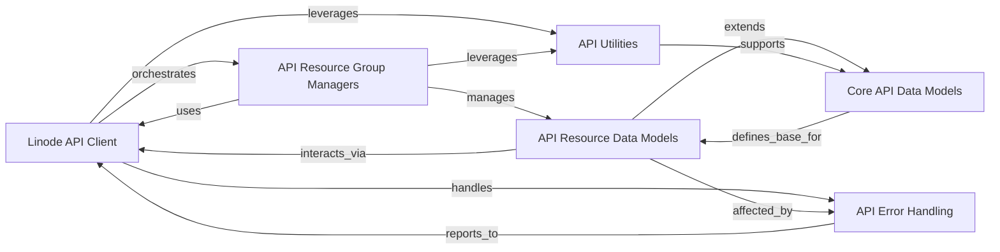

## Component Details

The `python-linode-api` project provides a comprehensive Python client for interacting with the Linode API. Its main flow involves a central API client that orchestrates requests, which are then managed by specialized resource group managers. These managers operate on structured API data models, with core models defining the base structure and specific models representing various Linode resources. The system also incorporates robust error handling and a suite of utility functions to support API interactions, including pagination, filtering, and authentication.

### Linode API Client
The primary client for interacting with the Linode API, responsible for authentication, request execution, response handling, and retry mechanisms. It orchestrates all API interactions.

**Related Classes/Methods**:

- <a href="https://github.com/linode/python-linode-api/blob/master/linode_api4/linode_client.py#L54-L488" target="_blank" rel="noopener noreferrer">`python-linode-api.linode_api4.linode_client.LinodeClient` (54:488)</a>
- <a href="https://github.com/linode/python-linode-api/blob/master/linode_api4/linode_client.py#L44-L51" target="_blank" rel="noopener noreferrer">`python-linode-api.linode_api4.linode_client.LinearRetry` (44:51)</a>
- <a href="https://github.com/linode/python-linode-api/blob/master/linode_api4/linode_client.py#L250-L302" target="_blank" rel="noopener noreferrer">`python-linode-api.linode_api4.linode_client.LinodeClient:_api_call` (250:302)</a>
- <a href="https://github.com/linode/python-linode-api/blob/master/linode_api4/linode_client.py#L304-L333" target="_blank" rel="noopener noreferrer">`python-linode-api.linode_api4.linode_client.LinodeClient:_get_objects` (304:333)</a>
- <a href="https://github.com/linode/python-linode-api/blob/master/linode_api4/linode_client.py#L335-L336" target="_blank" rel="noopener noreferrer">`python-linode-api.linode_api4.linode_client.LinodeClient:get` (335:336)</a>
- <a href="https://github.com/linode/python-linode-api/blob/master/linode_api4/linode_client.py#L338-L339" target="_blank" rel="noopener noreferrer">`python-linode-api.linode_api4.linode_client.LinodeClient:post` (338:339)</a>
- <a href="https://github.com/linode/python-linode-api/blob/master/linode_api4/linode_client.py#L341-L342" target="_blank" rel="noopener noreferrer">`python-linode-api.linode_api4.linode_client.LinodeClient:put` (341:342)</a>
- <a href="https://github.com/linode/python-linode-api/blob/master/linode_api4/linode_client.py#L344-L345" target="_blank" rel="noopener noreferrer">`python-linode-api.linode_api4.linode_client.LinodeClient:delete` (344:345)</a>

### API Resource Group Managers
A collection of specialized classes, each providing high-level methods for managing a specific category of Linode API resources (e.g., Linodes, Accounts, Databases, Domains). They abstract direct API calls for resource-specific operations.

**Related Classes/Methods**:

- <a href="https://github.com/linode/python-linode-api/blob/master/linode_api4/groups/linode.py#L29-L451" target="_blank" rel="noopener noreferrer">`python-linode-api.linode_api4.groups.linode.LinodeGroup` (29:451)</a>
- <a href="https://github.com/linode/python-linode-api/blob/master/linode_api4/groups/profile.py#L18-L345" target="_blank" rel="noopener noreferrer">`python-linode-api.linode_api4.groups.profile.ProfileGroup` (18:345)</a>
- <a href="https://github.com/linode/python-linode-api/blob/master/linode_api4/groups/account.py#L24-L512" target="_blank" rel="noopener noreferrer">`python-linode-api.linode_api4.groups.account.AccountGroup` (24:512)</a>
- <a href="https://github.com/linode/python-linode-api/blob/master/linode_api4/groups/networking.py#L16-L396" target="_blank" rel="noopener noreferrer">`python-linode-api.linode_api4.groups.networking.NetworkingGroup` (16:396)</a>
- <a href="https://github.com/linode/python-linode-api/blob/master/linode_api4/groups/support.py#L17-L105" target="_blank" rel="noopener noreferrer">`python-linode-api.linode_api4.groups.support.SupportGroup` (17:105)</a>
- <a href="https://github.com/linode/python-linode-api/blob/master/linode_api4/groups/longview.py#L10-L107" target="_blank" rel="noopener noreferrer">`python-linode-api.linode_api4.groups.longview.LongviewGroup` (10:107)</a>
- <a href="https://github.com/linode/python-linode-api/blob/master/linode_api4/groups/object_storage.py#L29-L535" target="_blank" rel="noopener noreferrer">`python-linode-api.linode_api4.groups.object_storage.ObjectStorageGroup` (29:535)</a>
- <a href="https://github.com/linode/python-linode-api/blob/master/linode_api4/groups/lke.py#L17-L207" target="_blank" rel="noopener noreferrer">`python-linode-api.linode_api4.groups.lke.LKEGroup` (17:207)</a>
- <a href="https://github.com/linode/python-linode-api/blob/master/linode_api4/groups/database.py#L20-L377" target="_blank" rel="noopener noreferrer">`python-linode-api.linode_api4.groups.database.DatabaseGroup` (20:377)</a>
- <a href="https://github.com/linode/python-linode-api/blob/master/linode_api4/groups/nodebalancer.py#L6-L70" target="_blank" rel="noopener noreferrer">`python-linode-api.linode_api4.groups.nodebalancer.NodeBalancerGroup` (6:70)</a>
- <a href="https://github.com/linode/python-linode-api/blob/master/linode_api4/groups/domain.py#L6-L61" target="_blank" rel="noopener noreferrer">`python-linode-api.linode_api4.groups.domain.DomainGroup` (6:61)</a>
- <a href="https://github.com/linode/python-linode-api/blob/master/linode_api4/groups/tag.py#L6-L116" target="_blank" rel="noopener noreferrer">`python-linode-api.linode_api4.groups.tag.TagGroup` (6:116)</a>
- <a href="https://github.com/linode/python-linode-api/blob/master/linode_api4/groups/volume.py#L7-L95" target="_blank" rel="noopener noreferrer">`python-linode-api.linode_api4.groups.volume.VolumeGroup` (7:95)</a>
- <a href="https://github.com/linode/python-linode-api/blob/master/linode_api4/groups/region.py#L6-L45" target="_blank" rel="noopener noreferrer">`python-linode-api.linode_api4.groups.region.RegionGroup` (6:45)</a>
- <a href="https://github.com/linode/python-linode-api/blob/master/linode_api4/groups/image.py#L12-L173" target="_blank" rel="noopener noreferrer">`python-linode-api.linode_api4.groups.image.ImageGroup` (12:173)</a>
- <a href="https://github.com/linode/python-linode-api/blob/master/linode_api4/groups/vpc.py#L9-L104" target="_blank" rel="noopener noreferrer">`python-linode-api.linode_api4.groups.vpc.VPCGroup` (9:104)</a>
- <a href="https://github.com/linode/python-linode-api/blob/master/linode_api4/groups/polling.py#L9-L91" target="_blank" rel="noopener noreferrer">`python-linode-api.linode_api4.groups.polling.PollingGroup` (9:91)</a>
- <a href="https://github.com/linode/python-linode-api/blob/master/linode_api4/groups/beta.py#L5-L24" target="_blank" rel="noopener noreferrer">`python-linode-api.linode_api4.groups.beta.BetaProgramGroup` (5:24)</a>
- <a href="https://github.com/linode/python-linode-api/blob/master/linode_api4/groups/placement.py#L13-L76" target="_blank" rel="noopener noreferrer">`python-linode-api.linode_api4.groups.placement.PlacementAPIGroup` (13:76)</a>
- <a href="https://github.com/linode/python-linode-api/blob/master/linode_api4/groups/monitor.py#L19-L153" target="_blank" rel="noopener noreferrer">`python-linode-api.linode_api4.groups.monitor.MonitorGroup` (19:153)</a>
- <a href="https://github.com/linode/python-linode-api/blob/master/linode_api4/groups/lke_tier.py#L5-L40" target="_blank" rel="noopener noreferrer">`python-linode-api.linode_api4.groups.lke_tier.LKETierGroup` (5:40)</a>

### Core API Data Models
Fundamental abstract classes that define the common structure and behavior for all Linode API resources, handling object instantiation, attribute management, and basic serialization/deserialization.

**Related Classes/Methods**:

- <a href="https://github.com/linode/python-linode-api/blob/master/linode_api4/objects/base.py#L147-L506" target="_blank" rel="noopener noreferrer">`python-linode-api.linode_api4.objects.base.Base` (147:506)</a>
- <a href="https://github.com/linode/python-linode-api/blob/master/linode_api4/objects/base.py#L73-L144" target="_blank" rel="noopener noreferrer">`python-linode-api.linode_api4.objects.base.MappedObject` (73:144)</a>
- <a href="https://github.com/linode/python-linode-api/blob/master/linode_api4/objects/serializable.py#L43-L258" target="_blank" rel="noopener noreferrer">`python-linode-api.linode_api4.objects.serializable.JSONObject` (43:258)</a>
- <a href="https://github.com/linode/python-linode-api/blob/master/linode_api4/objects/serializable.py#L26-L39" target="_blank" rel="noopener noreferrer">`python-linode-api.linode_api4.objects.serializable.JSONFilterableMetaclass` (26:39)</a>
- <a href="https://github.com/linode/python-linode-api/blob/master/linode_api4/objects/dbase.py#L4-L27" target="_blank" rel="noopener noreferrer">`python-linode-api.linode_api4.objects.dbase.DerivedBase` (4:27)</a>
- <a href="https://github.com/linode/python-linode-api/blob/master/linode_api4/objects/base.py#L509-L535" target="_blank" rel="noopener noreferrer">`python-linode-api.linode_api4.objects.base._flatten_request_body_recursive` (509:535)</a>

### API Resource Data Models
Concrete data models representing various Linode API resources such as Linode instances, databases, object storage, networking components, LKE clusters, NodeBalancers, account details, user profiles, domains, volumes, images, tags, support tickets, placement groups, and regions. These models extend the `Core API Data Models` to provide resource-specific attributes and methods.

**Related Classes/Methods**:

- `python-linode-api.linode_api4.objects.linode.Instance` (full file reference)
- `python-linode-api.linode_api4.objects.linode.Backup` (full file reference)
- `python-linode-api.linode_api4.objects.linode.Disk` (full file reference)
- `python-linode-api.linode_api4.objects.linode.Config` (full file reference)
- `python-linode-api.linode_api4.objects.linode.NetworkInterface` (full file reference)
- `python-linode-api.linode_api4.objects.linode.StackScript` (full file reference)
- `python-linode-api.linode_api4.objects.linode.Type` (full file reference)
- `linode_api4.objects.linode.UserDefinedField` (full file reference)
- <a href="https://github.com/linode/python-linode-api/blob/master/linode_api4/objects/database.py#L15-L44" target="_blank" rel="noopener noreferrer">`python-linode-api.linode_api4.objects.database.DatabaseType` (15:44)</a>
- <a href="https://github.com/linode/python-linode-api/blob/master/linode_api4/objects/database.py#L47-L74" target="_blank" rel="noopener noreferrer">`python-linode-api.linode_api4.objects.database.DatabaseEngine` (47:74)</a>
- <a href="https://github.com/linode/python-linode-api/blob/master/linode_api4/objects/database.py#L274-L436" target="_blank" rel="noopener noreferrer">`python-linode-api.linode_api4.objects.database.MySQLDatabase` (274:436)</a>
- <a href="https://github.com/linode/python-linode-api/blob/master/linode_api4/objects/database.py#L439-L603" target="_blank" rel="noopener noreferrer">`python-linode-api.linode_api4.objects.database.PostgreSQLDatabase` (439:603)</a>
- <a href="https://github.com/linode/python-linode-api/blob/master/linode_api4/objects/database.py#L612-L670" target="_blank" rel="noopener noreferrer">`python-linode-api.linode_api4.objects.database.Database` (612:670)</a>
- <a href="https://github.com/linode/python-linode-api/blob/master/linode_api4/objects/object_storage.py#L82-L502" target="_blank" rel="noopener noreferrer">`python-linode-api.linode_api4.objects.object_storage.ObjectStorageBucket` (82:502)</a>
- <a href="https://github.com/linode/python-linode-api/blob/master/linode_api4/objects/object_storage.py#L561-L578" target="_blank" rel="noopener noreferrer">`python-linode-api.linode_api4.objects.object_storage.ObjectStorageKeys` (561:578)</a>
- <a href="https://github.com/linode/python-linode-api/blob/master/linode_api4/objects/object_storage.py#L581-L616" target="_blank" rel="noopener noreferrer">`python-linode-api.linode_api4.objects.object_storage.ObjectStorageQuota` (581:616)</a>
- <a href="https://github.com/linode/python-linode-api/blob/master/linode_api4/objects/networking.py#L198-L307" target="_blank" rel="noopener noreferrer">`python-linode-api.linode_api4.objects.networking.Firewall` (198:307)</a>
- <a href="https://github.com/linode/python-linode-api/blob/master/linode_api4/objects/networking.py#L60-L127" target="_blank" rel="noopener noreferrer">`python-linode-api.linode_api4.objects.networking.IPAddress` (60:127)</a>
- <a href="https://github.com/linode/python-linode-api/blob/master/linode_api4/objects/networking.py#L26-L45" target="_blank" rel="noopener noreferrer">`linode_api4.objects.networking.IPv6Range` (26:45)</a>
- <a href="https://github.com/linode/python-linode-api/blob/master/linode_api4/objects/networking.py#L179-L195" target="_blank" rel="noopener noreferrer">`python-linode-api.linode_api4.objects.networking.FirewallDevice` (179:195)</a>
- <a href="https://github.com/linode/python-linode-api/blob/master/linode_api4/objects/lke.py#L267-L639" target="_blank" rel="noopener noreferrer">`python-linode-api.linode_api4.objects.lke.LKECluster` (267:639)</a>
- <a href="https://github.com/linode/python-linode-api/blob/master/linode_api4/objects/lke.py#L173-L264" target="_blank" rel="noopener noreferrer">`python-linode-api.linode_api4.objects.lke.LKENodePool` (173:264)</a>
- <a href="https://github.com/linode/python-linode-api/blob/master/linode_api4/objects/lke.py#L147-L170" target="_blank" rel="noopener noreferrer">`python-linode-api.linode_api4.objects.lke.LKENodePoolNode` (147:170)</a>
- <a href="https://github.com/linode/python-linode-api/blob/master/linode_api4/objects/nodebalancer.py#L232-L357" target="_blank" rel="noopener noreferrer">`python-linode-api.linode_api4.objects.nodebalancer.NodeBalancer` (232:357)</a>
- <a href="https://github.com/linode/python-linode-api/blob/master/linode_api4/objects/nodebalancer.py#L75-L229" target="_blank" rel="noopener noreferrer">`python-linode-api.linode_api4.objects.nodebalancer.NodeBalancerConfig` (75:229)</a>
- <a href="https://github.com/linode/python-linode-api/blob/master/linode_api4/objects/nodebalancer.py#L30-L72" target="_blank" rel="noopener noreferrer">`python-linode-api.linode_api4.objects.nodebalancer.NodeBalancerNode` (30:72)</a>
- <a href="https://github.com/linode/python-linode-api/blob/master/linode_api4/objects/account.py#L25-L56" target="_blank" rel="noopener noreferrer">`python-linode-api.linode_api4.objects.account.Account` (25:56)</a>
- <a href="https://github.com/linode/python-linode-api/blob/master/linode_api4/objects/account.py#L183-L201" target="_blank" rel="noopener noreferrer">`python-linode-api.linode_api4.objects.account.AccountSettings` (183:201)</a>
- <a href="https://github.com/linode/python-linode-api/blob/master/linode_api4/objects/account.py#L59-L89" target="_blank" rel="noopener noreferrer">`python-linode-api.linode_api4.objects.account.ChildAccount` (59:89)</a>
- <a href="https://github.com/linode/python-linode-api/blob/master/linode_api4/objects/account.py#L204-L331" target="_blank" rel="noopener noreferrer">`python-linode-api.linode_api4.objects.account.Event` (204:331)</a>
- <a href="https://github.com/linode/python-linode-api/blob/master/linode_api4/objects/account.py#L334-L366" target="_blank" rel="noopener noreferrer">`python-linode-api.linode_api4.objects.account.InvoiceItem` (334:366)</a>
- <a href="https://github.com/linode/python-linode-api/blob/master/linode_api4/objects/account.py#L390-L488" target="_blank" rel="noopener noreferrer">`python-linode-api.linode_api4.objects.account.OAuthClient` (390:488)</a>
- <a href="https://github.com/linode/python-linode-api/blob/master/linode_api4/objects/account.py#L130-L162" target="_blank" rel="noopener noreferrer">`python-linode-api.linode_api4.objects.account.PaymentMethod` (130:162)</a>
- <a href="https://github.com/linode/python-linode-api/blob/master/linode_api4/objects/account.py#L92-L127" target="_blank" rel="noopener noreferrer">`python-linode-api.linode_api4.objects.account.ServiceTransfer` (92:127)</a>
- <a href="https://github.com/linode/python-linode-api/blob/master/linode_api4/objects/account.py#L507-L555" target="_blank" rel="noopener noreferrer">`python-linode-api.linode_api4.objects.account.User` (507:555)</a>
- <a href="https://github.com/linode/python-linode-api/blob/master/linode_api4/objects/account.py#L619-L703" target="_blank" rel="noopener noreferrer">`python-linode-api.linode_api4.objects.account.UserGrants` (619:703)</a>
- <a href="https://github.com/linode/python-linode-api/blob/master/linode_api4/objects/account.py#L577-L616" target="_blank" rel="noopener noreferrer">`linode_api4.objects.account.Grant` (577:616)</a>
- <a href="https://github.com/linode/python-linode-api/blob/master/linode_api4/objects/profile.py#L59-L186" target="_blank" rel="noopener noreferrer">`python-linode-api.linode_api4.objects.profile.Profile` (59:186)</a>
- <a href="https://github.com/linode/python-linode-api/blob/master/linode_api4/objects/profile.py#L25-L41" target="_blank" rel="noopener noreferrer">`python-linode-api.linode_api4.objects.profile.PersonalAccessToken` (25:41)</a>
- <a href="https://github.com/linode/python-linode-api/blob/master/linode_api4/objects/profile.py#L189-L203" target="_blank" rel="noopener noreferrer">`python-linode-api.linode_api4.objects.profile.SSHKey` (189:203)</a>
- <a href="https://github.com/linode/python-linode-api/blob/master/linode_api4/objects/profile.py#L44-L56" target="_blank" rel="noopener noreferrer">`python-linode-api.linode_api4.objects.profile.WhitelistEntry` (44:56)</a>
- <a href="https://github.com/linode/python-linode-api/blob/master/linode_api4/objects/domain.py#L34-L160" target="_blank" rel="noopener noreferrer">`python-linode-api.linode_api4.objects.domain.Domain` (34:160)</a>
- <a href="https://github.com/linode/python-linode-api/blob/master/linode_api4/objects/domain.py#L5-L31" target="_blank" rel="noopener noreferrer">`python-linode-api.linode_api4.objects.domain.DomainRecord` (5:31)</a>
- <a href="https://github.com/linode/python-linode-api/blob/master/linode_api4/objects/volume.py#L31-L147" target="_blank" rel="noopener noreferrer">`python-linode-api.linode_api4.objects.volume.Volume` (31:147)</a>
- <a href="https://github.com/linode/python-linode-api/blob/master/linode_api4/objects/image.py#L33-L89" target="_blank" rel="noopener noreferrer">`python-linode-api.linode_api4.objects.image.Image` (33:89)</a>
- <a href="https://github.com/linode/python-linode-api/blob/master/linode_api4/objects/tag.py#L19-L79" target="_blank" rel="noopener noreferrer">`python-linode-api.linode_api4.objects.tag.Tag` (19:79)</a>
- <a href="https://github.com/linode/python-linode-api/blob/master/linode_api4/objects/tag.py#L82-L132" target="_blank" rel="noopener noreferrer">`python-linode-api.linode_api4.objects.tag.TaggedObjectProxy` (82:132)</a>
- <a href="https://github.com/linode/python-linode-api/blob/master/linode_api4/objects/support.py#L39-L190" target="_blank" rel="noopener noreferrer">`python-linode-api.linode_api4.objects.support.SupportTicket` (39:190)</a>
- <a href="https://github.com/linode/python-linode-api/blob/master/linode_api4/objects/support.py#L18-L36" target="_blank" rel="noopener noreferrer">`python-linode-api.linode_api4.objects.support.TicketReply` (18:36)</a>
- <a href="https://github.com/linode/python-linode-api/blob/master/linode_api4/objects/placement.py#L57-L128" target="_blank" rel="noopener noreferrer">`python-linode-api.linode_api4.objects.placement.PlacementGroup` (57:128)</a>
- <a href="https://github.com/linode/python-linode-api/blob/master/linode_api4/objects/region.py#L19-L51" target="_blank" rel="noopener noreferrer">`python-linode-api.linode_api4.objects.region.Region` (19:51)</a>

### API Error Handling
Manages and represents various error types that can be returned by the Linode API, providing structured information for error diagnosis and handling.

**Related Classes/Methods**:

- <a href="https://github.com/linode/python-linode-api/blob/master/linode_api4/errors.py#L11-L100" target="_blank" rel="noopener noreferrer">`python-linode-api.linode_api4.errors.ApiError` (11:100)</a>
- <a href="https://github.com/linode/python-linode-api/blob/master/linode_api4/errors.py#L103-L149" target="_blank" rel="noopener noreferrer">`python-linode-api.linode_api4.errors.UnexpectedResponseError` (103:149)</a>
- <a href="https://github.com/linode/python-linode-api/blob/master/linode_api4/polling.py#L9-L26" target="_blank" rel="noopener noreferrer">`python-linode-api.linode_api4.polling.EventError` (9:26)</a>

### API Utilities
A collection of utility classes and functions that support various aspects of API interaction, including event polling, OAuth login, pagination, filtering, and general data manipulation.

**Related Classes/Methods**:

- <a href="https://github.com/linode/python-linode-api/blob/master/linode_api4/polling.py#L97-L250" target="_blank" rel="noopener noreferrer">`python-linode-api.linode_api4.polling.EventPoller` (97:250)</a>
- <a href="https://github.com/linode/python-linode-api/blob/master/linode_api4/polling.py#L29-L94" target="_blank" rel="noopener noreferrer">`python-linode-api.linode_api4.polling.TimeoutContext` (29:94)</a>
- <a href="https://github.com/linode/python-linode-api/blob/master/linode_api4/login_client.py#L325-L519" target="_blank" rel="noopener noreferrer">`python-linode-api.linode_api4.login_client.LinodeLoginClient` (325:519)</a>
- <a href="https://github.com/linode/python-linode-api/blob/master/linode_api4/login_client.py#L22-L322" target="_blank" rel="noopener noreferrer">`python-linode-api.linode_api4.login_client.OAuthScopes` (22:322)</a>
- <a href="https://github.com/linode/python-linode-api/blob/master/linode_api4/paginated_list.py#L6-L262" target="_blank" rel="noopener noreferrer">`python-linode-api.linode_api4.paginated_list.PaginatedList` (6:262)</a>
- <a href="https://github.com/linode/python-linode-api/blob/master/linode_api4/objects/filtering.py#L122-L173" target="_blank" rel="noopener noreferrer">`python-linode-api.linode_api4.objects.filtering.Filter` (122:173)</a>
- <a href="https://github.com/linode/python-linode-api/blob/master/linode_api4/objects/filtering.py#L176-L201" target="_blank" rel="noopener noreferrer">`python-linode-api.linode_api4.objects.filtering.FilterableAttribute` (176:201)</a>
- <a href="https://github.com/linode/python-linode-api/blob/master/linode_api4/objects/filtering.py#L69-L82" target="_blank" rel="noopener noreferrer">`linode_api4.objects.filtering.and_` (69:82)</a>
- <a href="https://github.com/linode/python-linode-api/blob/master/linode_api4/objects/filtering.py#L85-L102" target="_blank" rel="noopener noreferrer">`linode_api4.objects.filtering.order_by` (85:102)</a>
- <a href="https://github.com/linode/python-linode-api/blob/master/linode_api4/objects/filtering.py#L105-L119" target="_blank" rel="noopener noreferrer">`linode_api4.objects.filtering.limit` (105:119)</a>
- <a href="https://github.com/linode/python-linode-api/blob/master/linode_api4/util.py#L8-L29" target="_blank" rel="noopener noreferrer">`python-linode-api.linode_api4.util:drop_null_keys` (8:29)</a>
- <a href="https://github.com/linode/python-linode-api/blob/master/linode_api4/common.py#L16-L62" target="_blank" rel="noopener noreferrer">`linode_api4.common.load_and_validate_keys` (16:62)</a>
- `linode_api4.objects.linode._expand_placement_group_assignment` (full file reference)

### [FAQ](https://github.com/CodeBoarding/GeneratedOnBoardings/tree/main?tab=readme-ov-file#faq)